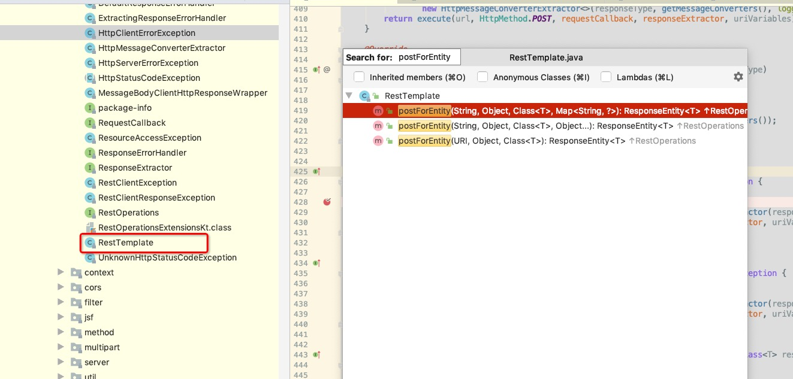
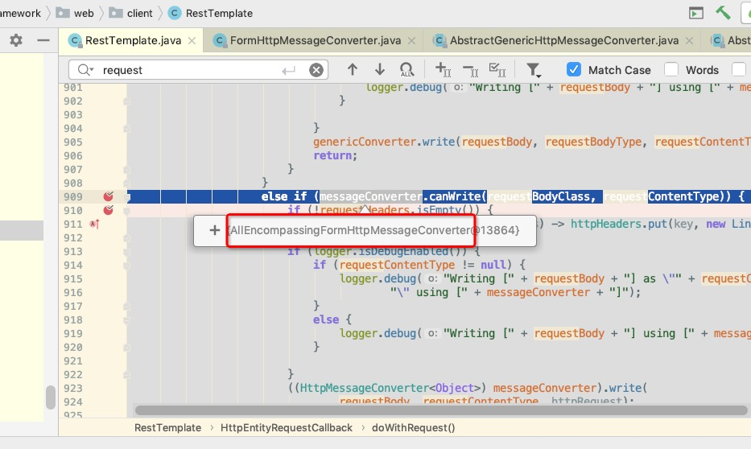
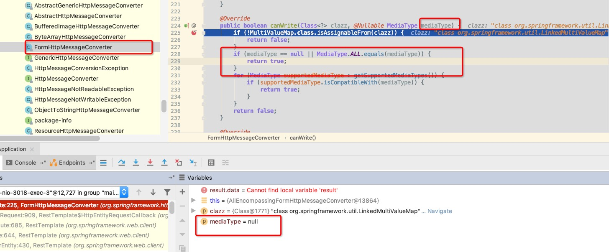
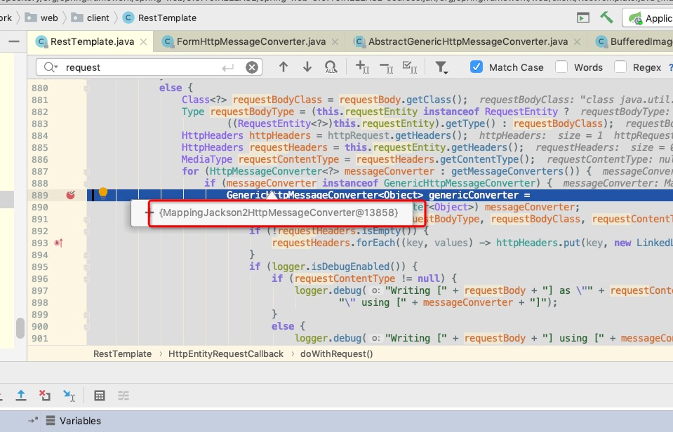
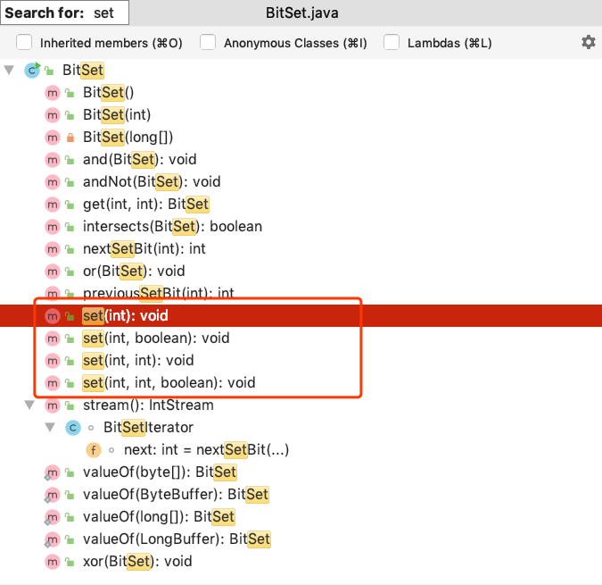

# 2020学习笔记

标签（空格分隔）： 未分类

---

微服务调用缓慢排查思路
===========

https://www.yunforum.net/group-topic-id-3827.html

https://zhuanlan.zhihu.com/p/82630599

个人认为，对于微服务调用慢的问题，可以采用以下一些方式进行查找：

如果使用了springcloud下的zipkin框架进行服务调用监控，那么可以针对一个指定的慢调用进行排查，得到是哪个服务慢；

如果已经知道了是哪个服务慢的情况下，可以分几步进行排查：首先是否数据库存在慢查询；机器物理资源使用情况；机器是否频繁GC等。

标题

如果没有使用zipkin等性能监控工具，可以自己在日志中加入相关的信息，比如微服务调用的出、入口。通过日志排查服务的耗时情况。

此外可以排查是否存在慢查询的sql等情况，甚至数据库死锁出现，相关可以参考[这里](https://github.com/Audi-A7/learn/blob/master/mysql%E5%AD%A6%E4%B9%A0.md#mysql%E6%80%A7%E8%83%BD%E6%8C%87%E6%A0%87%E7%9B%91%E6%8E%A7%E5%8F%8A%E6%AD%BB%E9%94%81%E6%A3%80%E6%B5%8B)。

springCloud性能优化
===============

https://juejin.im/post/5be83e166fb9a049a7115580

总的来说，个人认为一般都有以下几个方面：

 1. 首先是设置合理的ribbon或者feign超时时间以及重试机制。设置过短，网络抖动可能会误判为服务故障。设置过长，可能无法及时发现故障的服务，并且过长的超时时间会影响调用链的整体响应时间。
 2. 设置合理的GC算法。一般选用CMS（高响应）和G1（高吞吐量）。
 3. 合理调整JVM的堆栈大小配置。合理配置年轻代、老年代大小。
 4. 尽量不要使用大sql，避免数据库连接一直被占用。复杂的逻辑运算都放在java内来做。
 5. 接口幂等性需要得到保证。

RestTemplate的正确传参使用方式
=====================

 https://www.cnblogs.com/shoren/p/RestTemplate-problem.html
 
 之前在看springcloud的ribbon模块的源码的时候，接触过restTemplate。他可以比较方便的发起http请求，并且可以实现返回值的自动转换，但是使用的时候还是有几个细节需要注意。
 
 一般而言，参数的传递有几种，放在path里，放在queryString里，或者放在body里。需要注意传参的形式，否则可能出现接收不到参数的情况。我们以下面几个例子说明一下：
 
 首先分别实现几个方法，Method有GET\POST\PATCH\DELETE
 
```java
 
    @GetMapping("test1")
    public void test1(@ApiParam("游戏id") @RequestParam(name = "gameId") String gameId,
                      @ApiParam("设备udid") @RequestParam(name = "udid") String udid) {
        System.out.println("test1");
        System.out.println(gameId);
        System.out.println(udid);
    }

    @PostMapping("test2")
    public void test2(@ApiParam("游戏id") @RequestParam(name = "gameId") String gameId,
                      @ApiParam("设备udid") @RequestParam(name = "udid") String udid) {
        System.out.println("test2");
        System.out.println(gameId);
        System.out.println(udid);
    }

    @PostMapping("test3")
    public void test3(@RequestBody Action action) {
        System.out.println("test3");
        System.out.println(action.getCn());
        System.out.println(action.getEn());
    }

    @PatchMapping("test4")
    public void test4(@ApiParam("游戏id") @RequestParam(name = "gameId") String gameId,
                      @ApiParam("设备udid") @RequestParam(name = "udid") String udid) {
        System.out.println("test4");
        System.out.println(gameId);
        System.out.println(udid);
    }

    @PatchMapping("test5")
    public void test5(@RequestBody Action action) {
        System.out.println("test5");
        System.out.println(action.getCn());
        System.out.println(action.getEn());
    }

    @DeleteMapping("{id}/test6")
    public void test6(@ApiParam("游戏id") @PathVariable("id") Long id) {
        System.out.println("test6");
        System.out.println(id);
    }
```
然后使用RestTemplate发起对这几个接接口的调用，调用代码如下：

 1. 首先是test1

```java
    @Autowired
    private RestTemplate restTemplate;

    private static final String url = "http://127.0.0.1:3003/";

    @GetMapping("test1")
    public void test1() {
        log.info("test1");
        Map<String, String> map = new HashMap<>();
        map.put("gameId", "7283");
        map.put("udid", "cbsjhcs");
        // 如果下面的url中不像下面这样使用占位符，getForEntity方法是不会自动map中的数据替换到url中的
        restTemplate.getForEntity(url + "test1?gameId={gameId}&udid={udid}", Void.class, map);
    }
```

可以调用略微麻烦。

 1. 然后是post

需要注意点是，我们test2接收的时候，参数依然是按照queryString的形式接收的。下面使用的是MultiValueMap，不是HashMap，需要注意。
```java
    @PostMapping("test2")
    public void test2() {
        System.out.println("test2");
        MultiValueMap<String, Object> map = new LinkedMultiValueMap<>();
        map.add("gameId", "7283");
        map.add("udid", "cbsjhcs");
        restTemplate.postForEntity(url + "test2", map, Void.class);
    }
```

另外一种post，参数放在body内的，调用方式如下：
```java
    @PostMapping("test3")
    public void test3() {
        System.out.println("test3");
        Map<String, String> map = new HashMap<>();
        map.put("cn", "中文");
        map.put("en", "English");
//        MultiValueMap<String, Object> map = new LinkedMultiValueMap<>();
//        map.add("cn", "中文");
//        map.add("en", "English");
        restTemplate.postForEntity(url + "test3", map, Void.class);
    }
```
这里就不能使用MultiValueMap了，否则会报如下错误，其实就是post时使用MultiValueMap参数会被放到queryString上去：
```java
 Content type 'application/x-www-form-urlencoded;charset=UTF-8' not supported
```

 1. 然后是patch

注意同样是使用MultiValueMap来传递参数，因为在queryString上，否则就可以使用HashMap了。
```java
    @PatchMapping("test4")
    public void test4() {
        System.out.println("test4");

        MultiValueMap<String, Object> map = new LinkedMultiValueMap<>();
        map.add("gameId", "1013");
        map.add("udid", "csdcsdcsd");

        restTemplate.patchForObject(url + "test4", map, Void.class);
    }
```
注意使用patch方法，需要特殊构造RestTemplate对象。可以像下面这样直接new。
```java
private RestTemplate restTemplate = new RestTemplate(new HttpComponentsClientHttpRequestFactory());
```
当然更好的办法是通过配置类的方式，如下所示：
```java
@Configuration
@Slf4j
public class RestTemplateConfig {
    @Bean
    public RestTemplate restTemplate(){
        RestTemplate restTemplate = new RestTemplate();
        HttpComponentsClientHttpRequestFactory requestFactory = new HttpComponentsClientHttpRequestFactory();
        restTemplate.setRequestFactory(requestFactory);
        return restTemplate;
    }
}
```
如果不对RestTemplate进行特殊构造，默认是不会设置ClientHttpRequestFactory的。且此时使用RestTemplate发起patch调用会会宝如下错误：
```java
I/O error on PATCH request for "http://127.0.0.1:3003/test4": Invalid HTTP method: PATCH; nested exception is java.net.ProtocolException: Invalid HTTP method: PATCH
```
这个错误在https://github.com/spring-cloud/spring-cloud-netflix/issues/1777     和       https://github.com/spring-projects/spring-framework/issues/19618  都有提及。

问题的根源在于，spring底层的使用的是java的HttpURLConnection来发起http连接，在HttpURLConnection内，只允许如下一些方法：
```java
    /* valid HTTP methods */
    private static final String[] methods = {
        "GET", "POST", "HEAD", "OPTIONS", "PUT", "DELETE", "TRACE"
    };
```
在构造RestTemplate对象时，除了使用HttpComponentsClientHttpRequestFactory外，还可以使用Netty4ClientHttpRequestFactory, OkHttp3ClientHttpRequestFactory and OkHttpClientHttpRequestFactory。

然后是参数放在body里的方式来调用patch。其实和上面的参数放在queryString的patch很像，只是使用的HashMap传参，而不是LinkedMultiValueMap。源码如下：
```java
    @PatchMapping("test5")
    public void test5() {
        System.out.println("test5");
        Map<String, Object> map = new HashMap<>();
        map.put("cn", "中文");
        map.put("en", "English");

        restTemplate.patchForObject(url + "test5", map, Void.class);
    }
```

 1. 最后是Delete

注意其参数是在path内，我们可以使用类似于GET请求时，占位符的方式来调用传参。调用代码如下：

```java
    @DeleteMapping("test6")
    public void test6() {
        System.out.println("test6");

        Map<String, Object> map = new HashMap<>();
        map.put("id", 14515);

        restTemplate.delete(url + "{id}/test6", map);
    }
```

 - 总结

GET：需要使用占位符当时调用，RestTemplate无法自动填充key；

POST：参数在queryString上时，使用LinkedMultiValueMap传参，在body上时使用HashMap传参；

PATCH：调用方式同POST，但是需要特殊构造RestTemplate，设置ClientHttpRequestFactory；

DELETE：调用方式同GET

上面我们说，在POST中使用的Map类型不同，会早知参数传递的方式不一样，到底是什么导致了这种情况的发生？本质上来说，LinkedMultiValueMap和HashMap没什么不一样，仅仅是LinkedMultiValueMap的value也可以存储一个List。其实，答案是因为他们底层使用的MessageConverter不一样导致的。下面我们源码debug一次：

首先我们使用LinkedMultiValueMap传参，查看postForEntity的实现，有如下三种：



我们使用下面这种：
```java
	@Override
	public <T> ResponseEntity<T> postForEntity(String url, @Nullable Object request,
			Class<T> responseType, Object... uriVariables) throws RestClientException {

		RequestCallback requestCallback = httpEntityCallback(request, responseType);
		ResponseExtractor<ResponseEntity<T>> responseExtractor = responseEntityExtractor(responseType);
		return nonNull(execute(url, HttpMethod.POST, requestCallback, responseExtractor, uriVariables));
	}
```
可以看到我们传递的map其实是第二个参数request，spring会使用request构造一个RequestCallback对象。这个没什么好说的，接下来就是execute方法，源码如下：
```java
	@Override
	@Nullable
	public <T> T execute(String url, HttpMethod method, @Nullable RequestCallback requestCallback,
			@Nullable ResponseExtractor<T> responseExtractor, Object... uriVariables) throws RestClientException {

		URI expanded = getUriTemplateHandler().expand(url, uriVariables);
		return doExecute(expanded, method, requestCallback, responseExtractor);
	}
```
这里我们着重看一下doExecute方法，源码如下：
```java
	/**
	 * Execute the given method on the provided URI.
	 * <p>The {@link ClientHttpRequest} is processed using the {@link RequestCallback};
	 * the response with the {@link ResponseExtractor}.
	 * @param url the fully-expanded URL to connect to
	 * @param method the HTTP method to execute (GET, POST, etc.)
	 * @param requestCallback object that prepares the request (can be {@code null})
	 * @param responseExtractor object that extracts the return value from the response (can be {@code null})
	 * @return an arbitrary object, as returned by the {@link ResponseExtractor}
	 */
	@Nullable
	protected <T> T doExecute(URI url, @Nullable HttpMethod method, @Nullable RequestCallback requestCallback,
			@Nullable ResponseExtractor<T> responseExtractor) throws RestClientException {

		Assert.notNull(url, "URI is required");
		Assert.notNull(method, "HttpMethod is required");
		ClientHttpResponse response = null;
		try {
			ClientHttpRequest request = createRequest(url, method);
			if (requestCallback != null) {
				requestCallback.doWithRequest(request);
			}
			response = request.execute();
			handleResponse(url, method, response);
			return (responseExtractor != null ? responseExtractor.extractData(response) : null);
		}
		catch (IOException ex) {
			String resource = url.toString();
			String query = url.getRawQuery();
			resource = (query != null ? resource.substring(0, resource.indexOf('?')) : resource);
			throw new ResourceAccessException("I/O error on " + method.name() +
					" request for \"" + resource + "\": " + ex.getMessage(), ex);
		}
		finally {
			if (response != null) {
				response.close();
			}
		}
	}
```
这里与我们关心的requestCallback只有doWithRequest方法，我们再看下源码：
```java
		@Override
		@SuppressWarnings("unchecked")
		public void doWithRequest(ClientHttpRequest httpRequest) throws IOException {
			super.doWithRequest(httpRequest);
			Object requestBody = this.requestEntity.getBody();
			if (requestBody == null) {
				HttpHeaders httpHeaders = httpRequest.getHeaders();
				HttpHeaders requestHeaders = this.requestEntity.getHeaders();
				if (!requestHeaders.isEmpty()) {
					requestHeaders.forEach((key, values) -> httpHeaders.put(key, new LinkedList<>(values)));
				}
				if (httpHeaders.getContentLength() < 0) {
					httpHeaders.setContentLength(0L);
				}
			}
			else {
				Class<?> requestBodyClass = requestBody.getClass();
				Type requestBodyType = (this.requestEntity instanceof RequestEntity ?
						((RequestEntity<?>)this.requestEntity).getType() : requestBodyClass);
				HttpHeaders httpHeaders = httpRequest.getHeaders();
				HttpHeaders requestHeaders = this.requestEntity.getHeaders();
				MediaType requestContentType = requestHeaders.getContentType();
				for (HttpMessageConverter<?> messageConverter : getMessageConverters()) {
					if (messageConverter instanceof GenericHttpMessageConverter) {
						GenericHttpMessageConverter<Object> genericConverter =
								(GenericHttpMessageConverter<Object>) messageConverter;
						if (genericConverter.canWrite(requestBodyType, requestBodyClass, requestContentType)) {
							if (!requestHeaders.isEmpty()) {
								requestHeaders.forEach((key, values) -> httpHeaders.put(key, new LinkedList<>(values)));
							}
							if (logger.isDebugEnabled()) {
								if (requestContentType != null) {
									logger.debug("Writing [" + requestBody + "] as \"" + requestContentType +
											"\" using [" + messageConverter + "]");
								}
								else {
									logger.debug("Writing [" + requestBody + "] using [" + messageConverter + "]");
								}

							}
							genericConverter.write(requestBody, requestBodyType, requestContentType, httpRequest);
							return;
						}
					}
					else if (messageConverter.canWrite(requestBodyClass, requestContentType)) {
						if (!requestHeaders.isEmpty()) {
							requestHeaders.forEach((key, values) -> httpHeaders.put(key, new LinkedList<>(values)));
						}
						if (logger.isDebugEnabled()) {
							if (requestContentType != null) {
								logger.debug("Writing [" + requestBody + "] as \"" + requestContentType +
										"\" using [" + messageConverter + "]");
							}
							else {
								logger.debug("Writing [" + requestBody + "] using [" + messageConverter + "]");
							}

						}
						((HttpMessageConverter<Object>) messageConverter).write(
								requestBody, requestContentType, httpRequest);
						return;
					}
				}
				String message = "Could not write request: no suitable HttpMessageConverter found for request type [" +
						requestBodyClass.getName() + "]";
				if (requestContentType != null) {
					message += " and content type [" + requestContentType + "]";
				}
				throw new RestClientException(message);
			}
		}
```
这个方法就是导致两种map参数位置差异的根源，该方法会调用MessageConverter进行request的write。写入之前需要判断当前的MessageConverter是否是GenericHttpMessageConverter的子类，以及是否canWrite。

实际debug发现，使用MultiValueMap使用的是AllEncompassingFormHttpMessageConverter，如下图所示：



它的supportedMediaTypes如下图所示：


这已经可以说明参数会被放到queryString去了。保险起见我们再看一下canWrite方法，这里我们看的是FormHttpMessageConverter的canWrite方法。源码如下：
```java
	@Override
	public boolean canWrite(Class<?> clazz, @Nullable MediaType mediaType) {
		if (!MultiValueMap.class.isAssignableFrom(clazz)) {
			return false;
		}
		if (mediaType == null || MediaType.ALL.equals(mediaType)) {
			return true;
		}
		for (MediaType supportedMediaType : getSupportedMediaTypes()) {
			if (supportedMediaType.isCompatibleWith(mediaType)) {
				return true;
			}
		}
		return false;
	}
```
我们实际debug该方法时，会进入第二个if判断，因为我们的mediaType此时是空的，如下图所示：


至此，我们基本算明白了为什么MultiValueMap传递的参数为什么会被放到queryString上去。

然后分析，HashMap传参就简单多了，确实也是进入到doWithRequest方法，只不过此时使用的converter是MappingJackson2HttpMessageConverter。如下图所示：


它所支持的MediaTypes是application/json。保险起见我们也看一下他的canWrite方法。最终底层调用的其实是AbstractHttpMessageConverter抽象类的canWrite方法：
```java
	/**
	 * Returns {@code true} if the given media type includes any of the
	 * {@linkplain #setSupportedMediaTypes(List) supported media types}.
	 * @param mediaType the media type to write, can be {@code null} if not specified.
	 * Typically the value of an {@code Accept} header.
	 * @return {@code true} if the supported media types are compatible with the media type,
	 * or if the media type is {@code null}
	 */
	protected boolean canWrite(@Nullable MediaType mediaType) {
		if (mediaType == null || MediaType.ALL.equals(mediaType)) {
			return true;
		}
		for (MediaType supportedMediaType : getSupportedMediaTypes()) {
			if (supportedMediaType.isCompatibleWith(mediaType)) {
				return true;
			}
		}
		return false;
	}
```
由于入参mediaType为空，因此canWrite会返回true。如下图所示：
 
 
 总结：
 
 最终导致MultiValueMap和HashMap参数传递不一样的原因是因为Spring底层对于两者所选取的MessageConverter不一样导致的。
 
 

OAuth2学习
========

 1. https://www.jianshu.com/p/4f5fcddb4106
 2. https://www.jianshu.com/p/1f2d6e5126cb

提到OAuth2，我们不得不先说一下JSON Web Token (JWT)。


 
正确使用SpringCloud上传文件
===================

使用springBoot上传文件的时候，我们一般会使用来MultipartFile  类型来进行文件的接收，但是如果我们是SpringCloud的项目，文件二进制数据需要通过feign从一个应用传到另外一个应用，那么就需要做一些特殊的设置。

我们这里以bff服务调用workflow服务为例。

bff工程改造
-------

首先需要在bff引入pom依赖：
```java
<dependency>
    <groupId>io.github.openfeign.form</groupId>
    <artifactId>feign-form</artifactId>
    <version>3.0.3</version>
</dependency>
<dependency>
    <groupId>io.github.openfeign.form</groupId>
    <artifactId>feign-form-spring</artifactId>
    <version>3.2.2</version>
</dependency>
```
然后在bff写上配置类：

```java
import feign.codec.Encoder;
import feign.form.spring.SpringFormEncoder;
import org.springframework.beans.factory.ObjectFactory;
import org.springframework.beans.factory.annotation.Autowired;
import org.springframework.boot.autoconfigure.http.HttpMessageConverters;
import org.springframework.cloud.openfeign.support.SpringEncoder;
import org.springframework.context.annotation.Bean;
import org.springframework.context.annotation.Configuration;
 
/**
 * https://blog.csdn.net/guobinhui/article/details/102859095
 * <p>
 * 解决feign调用上传文件报错的问题
 *
 * @author WangQuanzhou
 * @date 2020-03-24
 */
@Configuration
public class MultipartSupportConfig {
 
    @Autowired
    private ObjectFactory<HttpMessageConverters> messageConverters;
 
    @Bean
    public Encoder feignFormEncoder() {
        return new SpringFormEncoder(new SpringEncoder(messageConverters));
    }
}
```

在bff工程中  @FeignClient上写上该配置类：
```java
import com.t4f.web.invoice.bff.api.config.MultipartSupportConfig;
import com.t4f.web.invoice.workflow.shared.BillApi;
import org.springframework.cloud.openfeign.FeignClient;
import org.springframework.stereotype.Component;
 
/**
 * 账单处理相关
 *
 * @author WangQuanzhou
 * @date 2019-03-26
 */
@FeignClient(name="invoice-workflow",configuration = MultipartSupportConfig.class)
@Component
public interface BillClient extends BillApi {
}
```

bff的对外入口上写上@RequestPart("file")来接收文件流以及consumes为MediaType.MULTIPART_FORM_DATA_VALUE，file不是固定的，只要和前端约定好该关键字就可以：
```java
/**
 * 前端页面将生产好的pdf文件上传到后端，目前只支持pdf格式
 *
 * @param userId 当前登录用户id
 * @param billId 账单id
 * @param file   合同信息
 * @return
 */
@PutMapping(value = "contract/upload/{billId}", consumes = MediaType.MULTIPART_FORM_DATA_VALUE)
@ApiOperation("前端页面将生产好的pdf文件上传到后端，目前只支持pdf格式")
public Result contractUpload(@ApiParam("用户id") @RequestHeader(name = "user_id") String userId,
                             @ApiParam("账单id") @PathVariable(name = "billId") String billId,
                             @RequestPart("file") MultipartFile file) throws IOException {
    log.info("received upload contract file request, userId = {}, billId = {}, file name = {}", userId, billId,
            file.getOriginalFilename());
    return billClient.contractUpload(userId, billId, file);
}
```

workflow工程改造
------------
bff工程会调用workflow的如下接口，注意设置consumes为MediaType.MULTIPART_FORM_DATA_VALUE

```java
@PutMapping(value = "contract/upload/{billId}", consumes = MediaType.MULTIPART_FORM_DATA_VALUE)
@ApiOperation("前端页面将生产好的pdf文件上传到后端，目前只支持pdf格式")
Result contractUpload(@ApiParam("用户id") @RequestHeader(name = "user_id") String userId,
                      @ApiParam("账单id") @PathVariable(name = "billId") String billId,
                      @RequestPart("file") MultipartFile file) throws IOException;
```

@RequestPart注解
--------------
注意一下这个注解，其实他本质上和@RequestParam注解区别不大，唯一的区别就是@RequestPart一般用于复杂的对象接收，如JSON、XML等，而@RequestParam一般用于较为简单的key-value的键值对接收。

下面是@RequestPart的源码注释，可以参考一下，里面有关于二者的区别介绍：
```java
/*
 * Copyright 2002-2016 the original author or authors.
 *
 * Licensed under the Apache License, Version 2.0 (the "License");
 * you may not use this file except in compliance with the License.
 * You may obtain a copy of the License at
 *
 *      http://www.apache.org/licenses/LICENSE-2.0
 *
 * Unless required by applicable law or agreed to in writing, software
 * distributed under the License is distributed on an "AS IS" BASIS,
 * WITHOUT WARRANTIES OR CONDITIONS OF ANY KIND, either express or implied.
 * See the License for the specific language governing permissions and
 * limitations under the License.
 */
 
package org.springframework.web.bind.annotation;
 
import java.beans.PropertyEditor;
import java.lang.annotation.Documented;
import java.lang.annotation.ElementType;
import java.lang.annotation.Retention;
import java.lang.annotation.RetentionPolicy;
import java.lang.annotation.Target;
 
import org.springframework.core.annotation.AliasFor;
import org.springframework.core.convert.converter.Converter;
import org.springframework.http.converter.HttpMessageConverter;
import org.springframework.web.multipart.MultipartFile;
import org.springframework.web.multipart.MultipartResolver;
 
/**
 * Annotation that can be used to associate the part of a "multipart/form-data" request
 * with a method argument.
 *
 * <p>Supported method argument types include {@link MultipartFile}
 * in conjunction with Spring's {@link MultipartResolver} abstraction,
 * {@code javax.servlet.http.Part} in conjunction with Servlet 3.0 multipart requests,
 * or otherwise for any other method argument, the content of the part is passed through an
 * {@link HttpMessageConverter} taking into consideration the 'Content-Type' header
 * of the request part. This is analogous to what @{@link RequestBody} does to resolve
 * an argument based on the content of a non-multipart regular request.
 *
 * <p>Note that @{@link RequestParam} annotation can also be used to associate the
 * part of a "multipart/form-data" request with a method argument supporting the same
 * method argument types. The main difference is that when the method argument is not a
 * String, @{@link RequestParam} relies on type conversion via a registered
 * {@link Converter} or {@link PropertyEditor} while @{@link RequestPart} relies
 * on {@link HttpMessageConverter}s taking into consideration the 'Content-Type' header
 * of the request part. @{@link RequestParam} is likely to be used with name-value form
 * fields while @{@link RequestPart} is likely to be used with parts containing more
 * complex content (e.g. JSON, XML).
 *
 * @author Rossen Stoyanchev
 * @author Arjen Poutsma
 * @author Sam Brannen
 * @since 3.1
 * @see RequestParam
 * @see org.springframework.web.servlet.mvc.method.annotation.RequestMappingHandlerAdapter
 */
@Target(ElementType.PARAMETER)
@Retention(RetentionPolicy.RUNTIME)
@Documented
public @interface RequestPart {
 
    /**
     * Alias for {@link #name}.
     */
    @AliasFor("name")
    String value() default "";
 
    /**
     * The name of the part in the {@code "multipart/form-data"} request to bind to.
     * @since 4.2
     */
    @AliasFor("value")
    String name() default "";
 
    /**
     * Whether the part is required.
     * <p>Defaults to {@code true}, leading to an exception being thrown
     * if the part is missing in the request. Switch this to
     * {@code false} if you prefer a {@code null} value if the part is
     * not present in the request.
     */
    boolean required() default true;
 
}
```

nodejs上传代码
----------

下面顺便附上nodejs上传文件的代码：

https://blog.csdn.net/Betterc5/article/details/102897858?depth_1-utm_source=distribute.pc_relevant.none-task&utm_source=distribute.pc_relevant.none-task

```javascript
const request = require('request');
const fs = require('fs');
 
function sendMultipart(filePath) {
    const formData = {
        file : fs.createReadStream(filePath)
    };
    let options = {
        method : 'POST',
        url : 'your url',
        headers : { 'Content-Type' : 'multipart/form-data' },
        formData : formData
    };
    return new Promise((resolve, reject) => {
        let readStream = Request(options, (error, response, body) => {
            if (!error) {
                resolve({response, body}); 
            } else {
                reject(error);
            }
        });
    });
}
```


java的BitSet
===========

 1. https://blog.csdn.net/u012736409/article/details/53735429
 2. https://blog.csdn.net/kongmin_123/article/details/82225172

首先介绍一下比特数组，本质上来说是个数组，只是数组的各个元素都是二进制，要么0，要么1.使用比特数组有什么好处呢？经典的使用方式，给出大量的正整数（亿级），希望快速判断，某个数在不在这一大堆数据中，此时使用比特数组在合适不过了。

理论上，1GB的比特数组可以存储1*1024*1024*1024*8=8589934592（85亿）个数字。

BitSet是java官方提供的比特数组的实现方式。我们看一下其实现的逻辑及几个重要的函数：
```java
package java.util;

import java.io.*;
import java.nio.ByteBuffer;
import java.nio.ByteOrder;
import java.nio.LongBuffer;
import java.util.stream.IntStream;
import java.util.stream.StreamSupport;

/**
 * This class implements a vector of bits that grows as needed. Each
 * component of the bit set has a {@code boolean} value. The
 * bits of a {@code BitSet} are indexed by nonnegative integers.
 * Individual indexed bits can be examined, set, or cleared. One
 * {@code BitSet} may be used to modify the contents of another
 * {@code BitSet} through logical AND, logical inclusive OR, and
 * logical exclusive OR operations.
 *
 * <p>By default, all bits in the set initially have the value
 * {@code false}.
 *
 * <p>Every bit set has a current size, which is the number of bits
 * of space currently in use by the bit set. Note that the size is
 * related to the implementation of a bit set, so it may change with
 * implementation. The length of a bit set relates to logical length
 * of a bit set and is defined independently of implementation.
 *
 * <p>Unless otherwise noted, passing a null parameter to any of the
 * methods in a {@code BitSet} will result in a
 * {@code NullPointerException}.
 *
 * <p>A {@code BitSet} is not safe for multithreaded use without
 * external synchronization.
 *
 * @author  Arthur van Hoff
 * @author  Michael McCloskey
 * @author  Martin Buchholz
 * @since   JDK1.0
 */
public class BitSet implements Cloneable, java.io.Serializable {
...
}
```

从源码可以看出，实际上它在jdk1.0的时候就已经存在了，历史还是相当久远的。

这里我们使用的是jdk1.8源码继续解析。主要涉及BitSet的以下一些部分：

 1. 初始化一个bitset，指定大小。
 2. 清空bitset。
 3. 反转某一指定位。
 4. 设置某一指定位。
 5. 获取某一位的状态。
 6. 当前bitset的bit总位数。

## 初始化

```java
    /**
     * The internal field corresponding to the serialField "bits".
     */
    private long[] words;
```
从源码及注释可以看出，BitSet内部使用long型数组存储数据。

其构造函数如下：
```java
    /**
     * Creates a new bit set. All bits are initially {@code false}.
     */
    public BitSet() {
        initWords(BITS_PER_WORD);
        sizeIsSticky = false;
    }

    /**
     * Creates a bit set whose initial size is large enough to explicitly
     * represent bits with indices in the range {@code 0} through
     * {@code nbits-1}. All bits are initially {@code false}.
     *
     * @param  nbits the initial size of the bit set
     * @throws NegativeArraySizeException if the specified initial size
     *         is negative
     */
    public BitSet(int nbits) {
        // nbits can't be negative; size 0 is OK
        if (nbits < 0)
            throw new NegativeArraySizeException("nbits < 0: " + nbits);

        initWords(nbits);
        sizeIsSticky = true;
    }

    private void initWords(int nbits) {
        words = new long[wordIndex(nbits-1) + 1];
    }

    /**
     * Creates a bit set using words as the internal representation.
     * The last word (if there is one) must be non-zero.
     */
    private BitSet(long[] words) {
        this.words = words;
        this.wordsInUse = words.length;
        checkInvariants();
    }
```
其默认构造函数的带下是一个long型，BitSet(int nbits)的大小是大于等于nbits的整数倍。整数倍的过程其实就体现在下面的代码的+1的这个操作。这么做的原因大概是为了考虑内存对齐吧。

```java
words = new long[wordIndex(nbits-1) + 1];
```
还有个构造函数，是使用已经存在的bit数组去初始化一个比特数组。

关于BitSet的大小，可以如下代码测试一下：
```java
    public static void main(String[] args) {
        BitSet bitSet = new BitSet();
        System.out.println("default size="+bitSet.size()+" "+bitSet.length());

        BitSet bitSet2 = new BitSet(1);
        System.out.println("        size="+bitSet2.size()+" "+bitSet2.length());

        BitSet bitSet3 = new BitSet(64);
        System.out.println("        size="+bitSet3.size()+" "+bitSet3.length());

        BitSet bitSet4 = new BitSet(65);
        System.out.println("        size="+bitSet4.size()+" "+bitSet4.length());
    }
```
输出结果如下：
```java
default size=64 0
        size=64 0
        size=64 0
        size=128 0
```
## 常用函数

### 设置指定位置为true

jdk源码如下：
```java
    /**
     * Sets the bit at the specified index to {@code true}.
     *
     * @param bitIndex a bit index
     * @throws IndexOutOfBoundsException if the specified index is negative
     * @since JDK1.0
     */
    public void set(int bitIndex) {
        if (bitIndex < 0)
            throw new IndexOutOfBoundsException("bitIndex < 0: " + bitIndex);

        int wordIndex = wordIndex(bitIndex);
        expandTo(wordIndex);

        words[wordIndex] |= (1L << bitIndex); // Restores invariants

        checkInvariants();
    }
```

根据BitSet的数据结构，我们知道他的数据实际上是存储在long[]数组里的，那么set的逻辑其实就很简单，首先根据bitIndex找到需要设置的word的index，也就是wordIndex。然后查看师傅需要扩容。最后根据words[wordIndex] |= (1L << bitIndex)，进行位或操作即可设置为true（1）。

这里注意一下"<<"操作，他是个循环左移操作。如果是针对long的位移操作，那么就是以64为周期，周期性移动。具体如下代码所示：
```java
    public static void main(String[] args) {
        System.out.println(1L << 2);
        System.out.println(1L << 66);
    }
```
输出如下：
```java
4
4
```

除了这个set方法外，它还有三个重载的set，如下图所示：



其中， set(int fromIndex, int toIndex)会把数据处理成三个部分，首部、中部、尾部。

### 设置指定位置为false

源码如下：
```java
    /**
     * Sets the bit specified by the index to {@code false}.
     *
     * @param bitIndex the index of the bit to be cleared
     * @throws IndexOutOfBoundsException if the specified index is negative
     * @since JDK1.0
     */
    public void clear(int bitIndex) {
        if (bitIndex < 0)
            throw new IndexOutOfBoundsException("bitIndex < 0: " + bitIndex);

        int wordIndex = wordIndex(bitIndex);
        if (wordIndex >= wordsInUse)
            return;

        words[wordIndex] &= ~(1L << bitIndex);

        recalculateWordsInUse();
        checkInvariants();
    }
```


原理类似于set(int)，只是这里多了一步recalculateWordsInUse的计算。其实，就是为了重新计算一下words的大小。比如，假设words的有效数据都在65及65位以下，此时将words的第65位设置为1，那么这个时候，实际有效的数据只有64位了。

源码如下：
```java
    /**
     * Sets the field wordsInUse to the logical size in words of the bit set.
     * WARNING:This method assumes that the number of words actually in use is
     * less than or equal to the current value of wordsInUse!
     */
    private void recalculateWordsInUse() {
        // Traverse the bitset until a used word is found
        int i;
        for (i = wordsInUse - 1; i >= 0; i--)
            if (words[i] != 0)
                break;

        wordsInUse = i + 1; // The new logical size
    }
```

### 获取特定位置的bool值

原理，比较简单，其实就是通过计算出wordIndex，然后与1L << bitIndex进行位与，通过判断结果是不是0来判断true、false。
```java
    /**
     * Returns the value of the bit with the specified index. The value
     * is {@code true} if the bit with the index {@code bitIndex}
     * is currently set in this {@code BitSet}; otherwise, the result
     * is {@code false}.
     *
     * @param bitIndex the bit index
     * @return the value of the bit with the specified index
     * @throws IndexOutOfBoundsException if the specified index is negative
     */
    public boolean get(int bitIndex) {
        if (bitIndex < 0)
            throw new IndexOutOfBoundsException("bitIndex < 0: " + bitIndex);

        checkInvariants();

        int wordIndex = wordIndex(bitIndex);
        return (wordIndex < wordsInUse)
                && ((words[wordIndex] & (1L << bitIndex)) != 0);
    }
```

### 获取当前bitset总bit的大小

```java
    /**
     * Returns the "logical size" of this {@code BitSet}: the index of
     * the highest set bit in the {@code BitSet} plus one. Returns zero
     * if the {@code BitSet} contains no set bits.
     *
     * @return the logical size of this {@code BitSet}
     * @since 1.2
     */
    public int length() {
        if (wordsInUse == 0)
            return 0;

        return BITS_PER_WORD * (wordsInUse - 1) +
                (BITS_PER_WORD - Long.numberOfLeadingZeros(words[wordsInUse - 1]));
    }
```
与之相似的还有size函数：
```java
    /**
     * Returns the number of bits of space actually in use by this
     * {@code BitSet} to represent bit values.
     * The maximum element in the set is the size - 1st element.
     *
     * @return the number of bits currently in this bit set
     */
    public int size() {
        return words.length * BITS_PER_WORD;
    }
```

源码上看，length需要去除头部的0，size不去除。

### hashCode
```java
    /**
     * Returns the hash code value for this bit set. The hash code depends
     * only on which bits are set within this {@code BitSet}.
     *
     * <p>The hash code is defined to be the result of the following
     * calculation:
     * <pre> {@code
     * public int hashCode() {
     *     long h = 1234;
     *     long[] words = toLongArray();
     *     for (int i = words.length; --i >= 0; )
     *         h ^= words[i] * (i + 1);
     *     return (int)((h >> 32) ^ h);
     * }}</pre>
     * Note that the hash code changes if the set of bits is altered.
     *
     * @return the hash code value for this bit set
     */
    public int hashCode() {
        long h = 1234;
        for (int i = wordsInUse; --i >= 0; )
            h ^= words[i] * (i + 1);

        return (int) ((h >> 32) ^ h);
    }
```
 
  

如何减少if-else
===========

https://blog.csdn.net/weixin_44750143/article/details/106304245?utm_medium=distribute.pc_category.none-task-blog-hot-2.nonecase&depth_1-utm_source=distribute.pc_category.none-task-blog-hot-2.nonecase&request_id=

一般来说，不要一上来就是各种设计模式，各种框架往上套，需要使用简洁明了的语法来进行优化。

1、拆解多层if嵌套，能直接return的就在最外层return
2、使用三元运算符
3、使用Optional替代null判断
4、使用枚举

Java线程（线程池）数据传递
==========

##主线程往线程池（子线程）传递数据
###主线程直接传递
主线程直接定义变量，只要线程池不对变量进行变更，就可以不需要定义成final类型。示例代码如下：

```java
// 这里的threadLocal是父线程的，因此可以正常取出auth变量
 String authDepth = threadLocal.get("auth");
                scheduledThreadPoolExecutor.schedule(new Runnable() {
                    @Override
                    public void run() {
                        try {
                            log.info("start to send batch mail, toList = {},", mail.getTo());
                            // 下面这样在线程池里，去threadLocal取变量是无法取出来的，因为此时的threadLocal已经是子线程的，而userName这个变量是存在父线程的threadLocal里的
                            GameMailDTO dto = constructMail(gameId, threadLocal.get("userName"), regionId, mail);
                            sendMail(authDepth, dto);
                            log.info("end send batch mail...");
                        } catch (Exception e) {
                            log.error("error occured while send batch mail", e);
                        }
                    }
                }, 5, TimeUnit.SECONDS);

            }
```
上面代码，使用线程池进行比较耗时的发邮件的操作。发送我们需要从主线程中获取部分用户的数据，如用户权限数据auth，用户姓名userName等。

但是这里值得注意的是，我们只是获取数据，并**不会**对数据进行**修改**，所以我们可以直接先从父线程的threadLocal将数据取出，使用局部变量的方式，传递给线程池。

###使用InheritableThreadLocal传递

这种方式只能实现父子线程之间的threadLocal传递，如果主线程中使用的是线程池，那么还是不行。

https://www.cnblogs.com/duanxz/p/5444805.html

https://www.cnblogs.com/Nonnetta/p/10175662.html

下面的代码是不能正穿传递父子threadLocal的示例：
```java
    public static void main(String[] args) {
        ThreadLocal<String> local = new ThreadLocal<>();
        local.set("我是主线程");

        Thread thread = new Thread(() -> {
            System.out.println(String.format("子线程获取主线程名称：%s", local.get()));
        });
        thread.start();

        List<Integer> integerList = IntStream.range(1, 10).boxed().collect(Collectors.toList());
        integerList.parallelStream().forEach(id ->
                System.out.println(String.format("流 %s 中获取主线程名称：%s", id, local.get())));
    }
```
程序运行输出如下：
```java
子线程获取主线程名称：null
流 2 中获取主线程名称：null
流 3 中获取主线程名称：null
流 1 中获取主线程名称：null
流 4 中获取主线程名称：null
流 8 中获取主线程名称：null
流 7 中获取主线程名称：null
流 9 中获取主线程名称：null
流 5 中获取主线程名称：null
流 6 中获取主线程名称：我是主线程
```

下面是使用InheritableThreadLocal在父子线程间传递数据的示例代码：
```java
    public static void main(String[] args) {
        ThreadLocal<String> local = new InheritableThreadLocal<>();
        local.set("我是主线程");

        Thread thread = new Thread(() -> {
            System.out.println(String.format("子线程获取主线程名称：%s", local.get()));
        });
        thread.start();

        List<Integer> integerList = IntStream.range(1, 10).boxed().collect(Collectors.toList());
        integerList.parallelStream().forEach(id ->
                System.out.println(String.format("流 %s 中获取主线程名称：%s", id, local.get())));
    }
```

程序运行输出如下：
```java
子线程获取主线程名称：我是主线程
流 3 中获取主线程名称：我是主线程
流 2 中获取主线程名称：我是主线程
流 4 中获取主线程名称：我是主线程
流 1 中获取主线程名称：我是主线程
流 8 中获取主线程名称：我是主线程
流 7 中获取主线程名称：我是主线程
流 9 中获取主线程名称：我是主线程
流 5 中获取主线程名称：我是主线程
流 6 中获取主线程名称：我是主线程
```

这种方式，本质上来说，其实就是在父线程中通过设置InheritableThreadLocal，来达到数据传递到子线程的过程。

具体的赋值过程是在Thread类的init方法完成的。当父亲线程中对inherThreadLocals进行了赋值，就会把当前线程的本地变量（也就是父线程的inherThreadLocals）进行createInheritedMap方法操作。init方法源码如下：
```java
    /**
     * Initializes a Thread with the current AccessControlContext.
     * @see #init(ThreadGroup,Runnable,String,long,AccessControlContext,boolean)
     */
    private void init(ThreadGroup g, Runnable target, String name,
                      long stackSize) {
        init(g, target, name, stackSize, null, true);
    }

// 上面的init方法调用了下面的init方法。

/**
     * Initializes a Thread.
     *
     * @param g the Thread group
     * @param target the object whose run() method gets called
     * @param name the name of the new Thread
     * @param stackSize the desired stack size for the new thread, or
     *        zero to indicate that this parameter is to be ignored.
     * @param acc the AccessControlContext to inherit, or
     *            AccessController.getContext() if null
     * @param inheritThreadLocals if {@code true}, inherit initial values for
     *            inheritable thread-locals from the constructing thread
     */
    private void init(ThreadGroup g, Runnable target, String name,
                      long stackSize, AccessControlContext acc,
                      boolean inheritThreadLocals) {
        if (name == null) {
            throw new NullPointerException("name cannot be null");
        }

        this.name = name;

        // 获取当前线程作为父线程
        Thread parent = currentThread();
        SecurityManager security = System.getSecurityManager();
        if (g == null) {
            /* Determine if it's an applet or not */

            /* If there is a security manager, ask the security manager
               what to do. */
            if (security != null) {
                g = security.getThreadGroup();
            }

            /* If the security doesn't have a strong opinion of the matter
               use the parent thread group. */
            if (g == null) {
                g = parent.getThreadGroup();
            }
        }

        /* checkAccess regardless of whether or not threadgroup is
           explicitly passed in. */
        g.checkAccess();

        /*
         * Do we have the required permissions?
         */
        if (security != null) {
            if (isCCLOverridden(getClass())) {
                security.checkPermission(SUBCLASS_IMPLEMENTATION_PERMISSION);
            }
        }

        g.addUnstarted();

        this.group = g;
        this.daemon = parent.isDaemon();
        this.priority = parent.getPriority();
        if (security == null || isCCLOverridden(parent.getClass()))
            this.contextClassLoader = parent.getContextClassLoader();
        else
            this.contextClassLoader = parent.contextClassLoader;
        this.inheritedAccessControlContext =
                acc != null ? acc : AccessController.getContext();
        this.target = target;
        setPriority(priority);
        // inheritThreadLocals为true  且父线程的inheritableThreadLocals已经设置过，那么就会将inheritableThreadLocals的数据传递到子线程
        if (inheritThreadLocals && parent.inheritableThreadLocals != null)
            this.inheritableThreadLocals =
                ThreadLocal.createInheritedMap(parent.inheritableThreadLocals);
        /* Stash the specified stack size in case the VM cares */
        this.stackSize = stackSize;

        /* Set thread ID */
        tid = nextThreadID();
    }
```

这种方法虽然可以实现父子线程的数据传递，但是存在一个问题，如果是父线程往线程池传递数据还是，因为线程池的线程池的线程一旦创建，一般不会进行销毁，也就不会再执行init方法，因此不行。

###阿里的transmittable-thread-local

https://github.com/alibaba/transmittable-thread-local

https://www.cnblogs.com/Nonnetta/p/10175662.html

本质上来说，他也是使用的InheritableThreadLocal，

它可以使用TtlRunnable和TtlCallable来修饰传入线程池的Runnable和Callable。或者也可以通过工具类com.alibaba.ttl.threadpool.TtlExecutors来完成线程池的数据传递。

或者可以使用Java Agent来修饰JDK线程池实现类，这种方式，实现线程池的传递是透明的，业务代码中没有修饰Runnable或是线程池的代码。即可以做到应用代码 无侵入。具体可以参加github的示例文档。


##线程池线程间交换数据

https://www.cnblogs.com/java-zzl/p/9741288.html

###可以使用同步队列

```java
public class SynchronousQueueTest {
    public static void main(String[] args) throws InterruptedException {

        SynchronousQueue<Integer> queue = new SynchronousQueue<Integer>();
        //线程A putThread
        Thread putThread = new Thread(new Runnable() {
            @Override
            public void run() {
                System.out.println("put thread start");
                try {
                    Thread.sleep(3000);
                    System.out.println("put thread put对象");
                    queue.put(1);
                } catch (InterruptedException e) {
                }
                System.out.println("put thread end");
            }
        });
        //线程B takeThread
        Thread takeThread = new Thread(new Runnable() {
            @Override
            public void run() {
                System.out.println("take thread start");
                try {
                    System.out.println("take thread 等待put对象");
                    System.out.println("take from putThread: " + queue.take());
                } catch (InterruptedException e) {
                }
                System.out.println("take thread end");
            }
        });

        putThread.start();
        takeThread.start();
    }
}
```

###可以使用Exchanger


```java
public class ExchangerTest {

    public static void main(String[] args) {
        ExecutorService service = Executors.newCachedThreadPool();
        final Exchanger exchanger = new Exchanger();
        service.execute(new Runnable(){
            public void run() {
                try {                
                    String data1 = "thread-1-data";
                    System.out.println("线程" + Thread.currentThread().getName() +"正在把数据" + data1 +"换出去");
                    Thread.sleep((long)(Math.random()*10000));
                    String data2 = (String)exchanger.exchange(data1);
                    System.out.println("线程" + Thread.currentThread().getName() + "换回的数据为" + data2);
                }catch(Exception e){
                    
                }
            }    
        });
        service.execute(new Runnable(){
            public void run() {
                try {                
                    String data1 = "thread-2-data";
                    System.out.println("线程" + Thread.currentThread().getName() + "正在把数据" + data1 +"换出去");
                    Thread.sleep((long)(Math.random()*10000));                    
                    String data2 = (String)exchanger.exchange(data1);
                    System.out.println("线程" + Thread.currentThread().getName() + "换回的数据为" + data2);
                }catch(Exception e){
                    
                }                
            }    
        });        
    }
}
```

mysql支持emoji表情
==============

 1. 数据库使用CHARSET=utf8mb4
    （如果你不确定是不是这个类型，最简单的就是编辑某个字段直接在navicat等工具里写入一个表情）
 2. 若使用springboot+druid数据库连接池，需要设置spring.datasource的如下配置：

```sql
    druid:
      connection-init-sqls: set names utf8mb4;
```

 1. 在springboot的pom文件中加入druid的starter：

```java
        <dependency>
            <groupId>com.alibaba</groupId>
            <artifactId>druid-spring-boot-starter</artifactId>
            <version>1.1.10</version>
        </dependency>
```


关于使用org.springframework.web.client.RestTemplate的get、post方法返回值的问题
================================================================

我们可以使用springBoot提供的RestTemplate方便的执行get、post方法，并且返回参数的类型也可以进行指定。如下代码格式、以get为例：
```java
ResponseEntity<UserStatusDTO> forEntity = restTemplate.getForEntity(outUrl, UserStatusDTO.class);
```
UserStatusDTO的定义如下：
```java
public class UserStatusDTO {

    @JsonProperty("status")
    private Boolean status;

    @JsonProperty("error_code")
    private String error_code;

    @JsonProperty("error_msg")
    private String error_msg;
}
```
如果getForEntity的返回值里，有一个参数没有在UserStatusDTO的定义中，那么就会触发一个报错。如下所示：
```java

```

todo: 单步调试org.springframework.web.client.RestTemplate的639行代码，看下其实现类，以及相应的类型转换代码。
