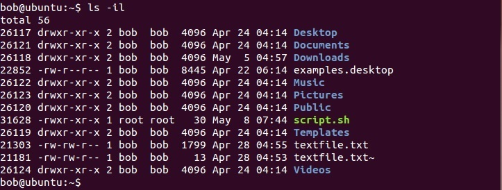

# 2021学习笔记

标签（空格分隔）： 学习

---

   * [2021学习笔记](#2021学习笔记)
      * [如何设计一个RPC框架](#如何设计一个rpc框架)
      * [常见数据mock框架](#常见数据mock框架)
         * [Mockito](#mockito)
      * [常用监控系统](#常用监控系统)
      * [linux的inode](#linux的inode)
      * [xxl-job](#xxl-job)
         * [全异步化](#全异步化)
         * [通讯数据加密](#通讯数据加密)
         * [分片广播 &amp; 动态分片](#分片广播--动态分片)
         * [执行器灰度上线](#执行器灰度上线)
      * [jobs](#jobs)

## 如何设计一个RPC框架

https://cloud.tencent.com/developer/article/1532039

https://zhuanlan.zhihu.com/p/62592174

一个完整的rpc框架设计图如下：


总共分为 3 层：

 - 服务层，Service，其中主要部分就是 **动态代理** ，主要用于将服务提供者的接口封装成远程服务调用。上层的服务接口用于 Spring之类的业务框架使用，也是 Spring 的 bean.
 - 过滤器层，服务调用职责链，提供多种调用切面供框架自身和使用者扩展，例如负载均衡，性能统计，服务调用完成通知，失败重试等。
 - RPC 层，这里就是 RPC 框架的核心部分，包括通信框架，序列化框架，还有用于屏蔽底层通信框架和序列化框架的抽象接口。


当前很多RPC框架都直接基于netty这一IO（NIO，参考[这里](https://github.com/AudiVehicle/learn/blob/master/2018%E5%AD%A6%E4%B9%A0%E7%AC%94%E8%AE%B0%EF%BC%88%E4%BA%8C%EF%BC%89.md#java%E4%B8%AD%E7%9A%84bionioaio)）通信框架，比如阿里巴巴的HSF、dubbo，Hadoop Avro，推荐使用Netty 作为底层通信框架。

## 常见数据mock框架
之所以需要mock数据框架，其实是为了方便单侧能够顺利进行下去，避免依赖方的服务或者网络波动造成单测不过。常见的mock数据框架有以下一些。
###  Mockito
https://www.toutiao.com/a6792424551180403208/

Mockito 是一种 Java Mock 框架，它可以模拟任何 Spring 管理的Bean、模拟方法的返回值、模拟抛出异常等等，同时也会记录调用这些模拟方法的参数、调用顺序，从而可以校验出这个 Mock 对象是否有被正确的顺序调用，以及按照期望的参数被调用。Mockito可以在单元测试中模拟一个 Service 返回的数据，而不会真正去调用该 Service，这就是上面提到的 Mock 测试精神，也就是通过模拟一个假的 Service 对象，来快速的测试当前我想要测试的类。需要指出的是，Mockito是springBoot内置的。


## 常用监控系统
https://www.toutiao.com/a6859620754003231243/

## linux的inode

https://geek-university.com/linux/inode/#:~:text=An%20inode%20is%20a%20data,%2C%20number%20of%20links%2C%20etc.&text=Some%20file%20systems%20(most%20notably,the%20file%20system%20is%20created.

An inode is a data structure that stores various information about a file in Linux, such as the access mode (read, write, execute permissions), ownership, file type, file size, group, number of links, etc. Each inode is identified by an integer number. An inode is assigned to a file when it is created.

Some file systems (most notably ext3) create all inodes when the file system is created. This means that it is possible to run out of storage because all of the inodes are used, although there is available space on the disk. Other file systems (like xfs) create inodes as needed.

You can view a file’s inode number using the ls -il command:



The first number on the left represents the inode number of the file.

总结来说，inode是一个整数，它包含了linux系统内文件的一些信息。且存在inode耗尽的风险「也就是系统产生了太多的文件，这种情况在使用xxl-job调度平台时可能出现，因为它的每一次调度都会生产一个log文件，可以提供设置日志保留天数进行控制」。


  
 
## xxl-job

https://www.xuxueli.com/xxl-job/#/?id=%E3%80%8A%E5%88%86%E5%B8%83%E5%BC%8F%E4%BB%BB%E5%8A%A1%E8%B0%83%E5%BA%A6%E5%B9%B3%E5%8F%B0xxl-job%E3%80%8B

使用`xxl-job`需要注意，每个任务的每次执行都会生产一个log文件，因此需要注意设置log文件的保存天数，避免耗尽机器的inode资源。

`xxl-job`在设计上，将调度器和执行器物理分开，实现解耦，并且有多个执行器时方便注册、移除。底层依赖mysql来实现数据一致性，集群任务调度等。

软件设计架构图如下：


 ### 全异步化
 
 xxl-job之所以性能较好，如上图所示使用了”异步调度队列“，且调度都是线程池异步执行，不会阻塞调度器。
 
 如若需要支撑更多的任务量，可以通过 “调大调度线程数” 、”降低调度中心与执行器ping延迟” 和 “提升机器配置” 几种方式优化。
 
 ### 通讯数据加密
 
调度中心向执行器发送的调度请求时使用RequestModel和ResponseModel两个对象封装调度请求参数和响应数据, 在进行通讯之前底层会将上述两个对象对象序列化，并进行数据协议以及时间戳检验,从而达到数据加密的功能。

### 分片广播 & 动态分片

其实也就是集群内的多个机器可以协调合作，xxl-job在调度时会附带分片参数，各个节点根据具体参数做相应协同处理。
```java
// 可参考Sample示例执行器中的示例任务"ShardingJobHandler"了解试用 
int shardIndex = XxlJobHelper.getShardIndex();
int shardTotal = XxlJobHelper.getShardTotal();
```
该特性适用场景如：

 1. 分片任务场景：10个执行器的集群来处理10w条数据，每台机器只需要处理1w条数据，耗时降低10倍；
 2. 广播任务场景：广播执行器机器运行shell脚本、广播集群节点进行缓存更新等

### 执行器灰度上线
调度中心与业务解耦，只需部署一次后常年不需要维护。但是，执行器中托管运行着业务作业，作业上线和变更需要重启执行器，尤其是Bean模式任务。
执行器重启可能会中断运行中的任务。但是，XXL-JOB得益于自建执行器与自建注册中心，可以通过灰度上线的方式，避免因重启导致的任务中断的问题。

步骤如下：

 1. 执行器改为手动注册，下线一半机器列表（A组），线上运行另一半机器列表（B组）；
 2. 等待A组机器任务运行结束并编译上线；执行器注册地址替换为A组；
 3. 等待B组机器任务运行结束并编译上线；执行器注册地址替换为A组+B组；

操作结束；
 
## jobs

https://github.com/baomidou/jobs
 
