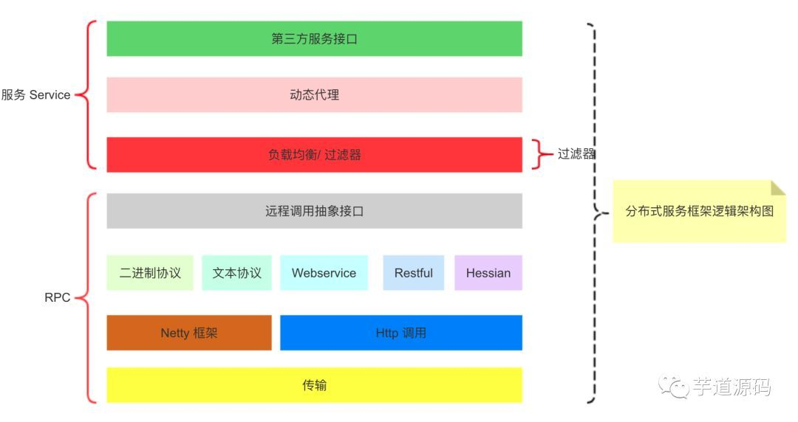

# 2021学习笔记

标签（空格分隔）： 学习

---

   * [2021学习笔记](#2021学习笔记)
      * [如何设计一个RPC框架](#如何设计一个rpc框架)
      * [常见数据mock框架](#常见数据mock框架)
         * [Mockito](#mockito)
      * [常用监控系统](#常用监控系统)

## 如何设计一个RPC框架

https://cloud.tencent.com/developer/article/1532039

https://zhuanlan.zhihu.com/p/62592174

一个完整的rpc框架设计图如下：

总共分为 3 层：

 - 服务层，Service，其中主要部分就是 **动态代理** ，主要用于将服务提供者的接口封装成远程服务调用。上层的服务接口用于 Spring之类的业务框架使用，也是 Spring 的 bean.
 - 过滤器层，服务调用职责链，提供多种调用切面供框架自身和使用者扩展，例如负载均衡，性能统计，服务调用完成通知，失败重试等。
 - RPC 层，这里就是 RPC 框架的核心部分，包括通信框架，序列化框架，还有用于屏蔽底层通信框架和序列化框架的抽象接口。

当前很多RPC框架都直接基于netty这一IO（NIO，参考[这里](https://github.com/AudiVehicle/learn/blob/master/2018%E5%AD%A6%E4%B9%A0%E7%AC%94%E8%AE%B0%EF%BC%88%E4%BA%8C%EF%BC%89.md#java%E4%B8%AD%E7%9A%84bionioaio)）通信框架，比如阿里巴巴的HSF、dubbo，Hadoop Avro，推荐使用Netty 作为底层通信框架。

## 常见数据mock框架
之所以需要mock数据框架，其实是为了方便单侧能够顺利进行下去，避免依赖方的服务或者网络波动造成单测不过。常见的mock数据框架有以下一些。
###  Mockito
https://www.toutiao.com/a6792424551180403208/

Mockito 是一种 Java Mock 框架，它可以模拟任何 Spring 管理的Bean、模拟方法的返回值、模拟抛出异常等等，同时也会记录调用这些模拟方法的参数、调用顺序，从而可以校验出这个 Mock 对象是否有被正确的顺序调用，以及按照期望的参数被调用。Mockito可以在单元测试中模拟一个 Service 返回的数据，而不会真正去调用该 Service，这就是上面提到的 Mock 测试精神，也就是通过模拟一个假的 Service 对象，来快速的测试当前我想要测试的类。需要指出的是，Mockito是springBoot内置的。

## 常用监控系统
https://www.toutiao.com/a6859620754003231243/

 
 
