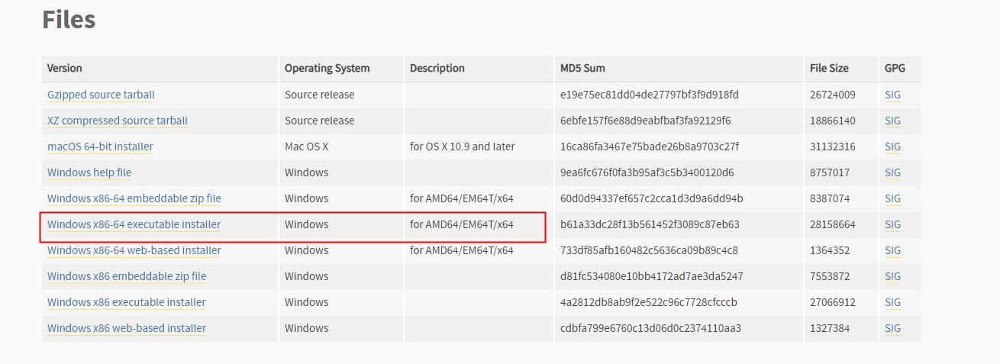
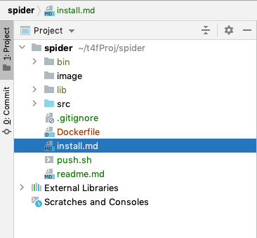

# spider

标签（空格分隔）： spider

---

爬虫相关学习，之前写过一个简单的爬虫，爬取一个网站的图片。但是当时没做笔记，现在记得也不是很清楚，花了点时间重新学习了下。

第一个demo
=======

### 首先是安装python
其实，爬虫不一定要python写，你喜欢的话，啥语言都可以。只是python这块现成封装的包比较多。

https://www.python.org/downloads/release/python-390/

下载适合自己操作系统的安装包。


安装过程，一路next，记得勾选将python路径添加到path，后续可以省去配置path。

### 然后是安装pip

注意，这一步不是必须的，pip的[官网](https://pip.pypa.io/en/stable/installing/)也写的很明白。

```html
pip is already installed if you are using Python 2 >=2.7.9 or Python 3 >=3.4 downloaded from python.org or if you are working in a Virtual Environment created by virtualenv or pyvenv. Just make sure to upgrade pip.
```
否则，就按照教程一步步安装即可。

### 然后是写一个简单的爬虫

https://www.cnblogs.com/yuanyuan2017/p/7137162.html

```python
# coding=utf-8
import urllib.request
import re


# 定义一个方法，把整个页面下载下来
def getHtml(url):
    page = urllib.request.urlopen(url)  # 打开网页
    html = page.read()  # 读取 URL上面的数据
    return html  # 返回内容


# 再定义一个方法，筛选页面中想要的元素，通过正则表达式的匹配
def getimage(html):
    reg = r'src="(.+?\.jpg)" pic_ext'  # 定义一个正则表达式
    # re.compile() 把正则表达式编译成一个正则表达式对象
    imagere = re.compile(reg)
    # 　re.findall() 方法读取html 中包含 imgre（正则表达式）的数据。
    imagerelist = re.findall(imagere, str(html))
    # 遍历图片
    x = 0
    for imageurl in imagerelist:
        # 百度这块对图片链接做了特殊处理：部分字符使用了16进制表示，需要特殊处理，这里我懒得去处理了，这只是一个示例
        # 这里的核心是用到了urllib.urlretrieve(),方法，直接将远程数据下载到本地
        urllib.request.urlretrieve(imageurl, '%s.jpg' % x)
        x = x + 1


# 调用getHtml 传入一个网址
ht = getHtml("http://tieba.baidu.com/p/2460150866")
# 调用getimage ，拿到图片
getimage(ht)
print("拉取成功...")
```

第二个demo，分析心电图
=============

https://blog.csdn.net/weixin_44728841/article/details/108981911


# 项目搭建手册

`项目基于python，爬取网站数据，部分文本信息存入mongo数据库，视频文件信息直接上传到阿里云oss`


## 环境信息
### 本地开发环境

 1. python：3.9.0
 2. macOS
 3. mongo：3.6.3
 4. idea：pycharm2020.2.3

`pip`为python的包管理器，类似于node的npm，pip不需要单独安装，python3以后的版本会附带。命令也相应的变成`pip3 install ...`
 
### 测试联调环境（docker容器环境部署）


 1. docker：18.09.0
 2. docker宿主机linux：16.04.4

## 项目结构
如下图所示：



## 项目简介

如果是在dev调试，并且需要启动web框架flask，那么直接在pycharm里运行app.py即可启动一个web服务器。

```python
## app.py

from flask import Flask
from flask import request
from facebookSpider import *

app = Flask(__name__)


@app.route('/', methods=['GET', 'POST'])
def home():
    helloStr = hello()
    return '<h1>' + helloStr + '</h1>'


@app.route('/signin', methods=['GET'])
def signin_form():
    return '''<form action="/signin" method="post">
              <p><input name="username"></p>
              <p><input name="password" type="password"></p>
              <p><button type="submit">Sign In</button></p>
              </form>'''


@app.route('/signin', methods=['POST'])
def signin():
    # 需要从request对象读取表单内容：
    if request.form['username'] == 'admin' and request.form['password'] == 'password':
        return '<h3>Hello, admin!</h3>'
    return '<h3>Bad username or password.</h3>'


if __name__ == '__main__':
    app.run()
```

启动flask，控制台输出如下所示：


```python
# coding:utf-8
'''
    facebookSpider.py
    代码仅用于学习用途，请勿用于商业或者非法使用，否则后果自负
    拉取facebook广告数据
    python版本3.9.0
'''

import requests
import json
import pymongo
import urllib
import ssl
import oss2
import os
import datetime
import shutil
from itertools import islice


def mkdir(path):
    folder = os.path.exists(path)
    if not folder:
        os.makedirs(path)
        print("创建文件夹成功，文件夹名称 =", path)
    else:
        print("文件夹已经存在，文件夹名称 =", path)


## 拉取facebook广告数据
def facebook():
    ssl._create_default_https_context = ssl._create_unverified_context

    url = 'https://www.facebook.com/ads/library/async/search_ads/?count=30&active_status=all&ad_type=all&countries[0]=US&view_all_page_id=366107457198874&session_id=73403ef5-5dfc-4900-9e14-41136add6268'

    headers = {
        'User-Agent': 'Mozilla/5.0 (Macintosh; Intel Mac OS X 10_14_5) AppleWebKit/537.36 (KHTML, like Gecko) Chrome/86.0.4240.75 Safari/537.36',
        'Referer': 'https://www.facebook.com/ads/library/?active_status=all&ad_type=all&country=US&view_all_page_id=366107457198874',
        'accept': '*/*',
        'authority': 'https://www.facebook.com',
        'sec-fetch-site': 'same-origin',
        'sec-fetch-mode': 'cors',
        'Content-Type': 'application/x-www-form-urlencoded',
        'accept-language': 'zh-CN,zh;q=0.9',
        'Cookie': 'datr=uAoMX6HZKV4jWSFOmxBROYQj; sb=55o0X4fizNz0G_ue9XPa2JDv; fr=0wWDU3tVoMYlRdaxv..BejBsk.zP.F9c.0.0.BfZEZe.; _fbp=fb.1.1602298312077.658950841; wd=1123x874'
    }

    data = {'__user': '0', '__a': '1'}

    print("开始拉取数据，时间 =", datetime.datetime.now())
    r = requests.post(url, headers=headers, data=data)
    body = r.text;
    forwardCursor, collationToken = parseData(body)
    while forwardCursor is not None:
        print("开始模拟下拉分页拉取数据，时间 =", datetime.datetime.now())
        forwardCursor, collationToken = forward(forwardCursor, collationToken);
        print("结束模拟下拉分页拉取数据，时间 =", datetime.datetime.now())

    print("结束拉取数据，时间 =", datetime.datetime.now())


## 模拟下拉刷新操作  获取全部数据
def forward(forward_cursor, collation_token):
    ssl._create_default_https_context = ssl._create_unverified_context

    url = 'https://www.facebook.com/ads/library/async/search_ads/?count=30&active_status=all&ad_type=all&countries[0]=US&view_all_page_id=366107457198874&session_id=73403ef5-5dfc-4900-9e14-41136add6268'
    url = url + "&forward_cursor=" + forward_cursor + "&collation_token=" + collation_token

    headers = {
        'User-Agent': 'Mozilla/5.0 (Macintosh; Intel Mac OS X 10_14_5) AppleWebKit/537.36 (KHTML, like Gecko) Chrome/86.0.4240.75 Safari/537.36',
        'Referer': 'http://www.uhenan.com/ScenicArea/List?t1=0&t2=1&t3=%200',
        'accept': '*/*',
        'authority': 'https://www.facebook.com',
        'sec-fetch-site': 'same-origin',
        'sec-fetch-mode': 'cors',
        'Content-Type': 'application/x-www-form-urlencoded',
        'accept-language': 'zh-CN,zh;q=0.9',
        'Cookie': 'datr=uAoMX6HZKV4jWSFOmxBROYQj; sb=55o0X4fizNz0G_ue9XPa2JDv; fr=0wWDU3tVoMYlRdaxv..BejBsk.zP.F9c.0.0.BfZEZe.; _fbp=fb.1.1602298312077.658950841; wd=1123x874'
    }

    data = {'__user': '0', '__a': '1'}

    r = requests.post(url, headers=headers, data=data)
    body = r.text;

    return parseData(body)


def parseData(body):
    print("开始解析数据及视频拉取，时间 =", datetime.datetime.now())
    array = body.split(');')
    if array.__sizeof__() > 1:
        body = array[1]
    ## print('body =', body)
    jsonObj = json.loads(body)
    forwardCursor = jsonObj['payload']['forwardCursor']
    collationToken = jsonObj['payload']['collationToken']
    results = jsonObj['payload']['results']
    print('forwardCursor = ', forwardCursor)
    print('collationToken = ', collationToken)

    print('建立mongo连接...')
    myclient = pymongo.MongoClient('mongodb://172.20.110.65:27017/')
    dblist = myclient.list_database_names()
    mydb = myclient["spider"]
    myCollection = mydb["facebook_ad"]

    print("预先清空数据库中数据...")
    myCollection.delete_many({})

    for x in results:
        for y in x:
            print('')
            adArchiveID = y['adArchiveID']
            isActive = y['isActive']
            startDate = y['startDate']
            publisherPlatform = y['publisherPlatform']
            print('isActive =', isActive, ' ,adArchiveID =', adArchiveID, ' ,startDate =', startDate,
                  ' ,publisherPlatform = ', publisherPlatform)
            cards = y['snapshot']['cards']

            print('写入数据到mongo...')
            content = []
            mydict = {"_id": adArchiveID, "adArchiveID": adArchiveID, "isActive": isActive,
                      "startDate": startDate, "publisherPlatform": publisherPlatform, "content": content}
            myCollection.insert_one(mydict)

            ## 视频文件名称后缀  eg:20201009_i.mp4
            i = 0

            if cards.__len__() > 0:
                for z in cards:
                    i = i + 1
                    body = z['body']
                    video_preview_image_url = "" if z['video_preview_image_url'] is None \
                        else z['video_preview_image_url']
                    video_sd_url = "" if z['video_sd_url'] is None \
                        else z['video_sd_url']
                    string = 'body =' + body + ' ,video_preview_image_url =' + video_preview_image_url + ' ,video_sd_url =' + video_sd_url
                    print(string)
                    if "" != video_sd_url:
                        downLoadVideo(adArchiveID, i, video_sd_url)
                    content.append(string)

            else:
                for z in y['snapshot']['videos']:
                    i = i + 1
                    body = y['snapshot']['body']['markup']['__html']
                    video_preview_image_url = "" if z['video_preview_image_url'] is None \
                        else z['video_preview_image_url']
                    video_sd_url = "" if z['video_sd_url'] is None \
                        else z['video_sd_url']
                    string = 'body =' + body + ' ,video_preview_image_url =' + video_preview_image_url + ' ,video_sd_url =' + video_sd_url
                    print(string)
                    if "" != video_sd_url:
                        downLoadVideo(adArchiveID, i, video_sd_url)
                    content.append(string)

            print('通过_id更新mongo...')
            myquery = {"_id": adArchiveID}
            newvalues = {"$set": {"content": content}}
            myCollection.update_one(myquery, newvalues)

    print("结束解析数据及视频拉取，时间 =", datetime.datetime.now())
    return forwardCursor, collationToken


def downLoadVideo(adArchiveID, i, video_sd_url):
    path = os.path.join('video', adArchiveID)
    mkdir(path)
    videoName = adArchiveID + '_' + str(i) + ".mp4"
    print("开始下载视频，视频名称 =", videoName)
    work_path = os.path.join(path, videoName)
    ## fixme 这里使用时  记得复原
    uploadStream2oss(video_sd_url, adArchiveID, videoName)
    # urllib.request.urlretrieve(video_sd_url, work_path);


def upload2oss():
    # 阿里云主账号AccessKey拥有所有API的访问权限，风险很高。强烈建议您创建并使用RAM账号进行API访问或日常运维，请登录 https://ram.console.aliyun.com 创建RAM账号。
    oss2.Auth('LTBuhG', 'avR0B')
    # Endpoint以杭州为例，其它Region请按实际情况填写。
    bucket = oss2.Bucket(auth, 'https://oss-cn-hangzhou.aliyuncs.com', 'b-gct')

    # <yourObjectName>上传文件到OSS时需要指定包含文件后缀在内的完整路径，例如abc/efg/123.jpg。
    # <yourLocalFile>由本地文件路径加文件名包括后缀组成，例如/users/local/myfile.txt。
    g = os.walk(r"video")
    for path, dir_list, file_list in g:
        for file_name in file_list:
            oss_file_name = os.path.join("facebook", path, file_name)
            local_file_name = os.path.join(path, file_name)
            print("上传本地视频文件到oss", " oss_file_name =", oss_file_name, "   local_file_name =", local_file_name)
            bucket.put_object_from_file(oss_file_name, local_file_name)

    # oss2.ObjectIteratorr用于遍历文件。
    print()
    print('遍历oss文件内容...')
    for b in islice(oss2.ObjectIterator(bucket), 0, None):
        print(b.key)


def uploadStream2oss(videoUrl, adArchiveID, fileName):
    # 阿里云主账号AccessKey拥有所有API的访问权限，风险很高。强烈建议您创建并使用RAM账号进行API访问或日常运维，请登录 https://ram.console.aliyun.com 创建RAM账号。
    oss2.Auth('LTBuhG', 'avR0B')
    # Endpoint以杭州为例，其它Region请按实际情况填写。
    bucket = oss2.Bucket(auth, 'https://oss-cn-hangzhou.aliyuncs.com', 'b-gct')

    # <yourObjectName>上传文件到OSS时需要指定包含文件后缀在内的完整路径，例如abc/efg/123.jpg。
    # <yourLocalFile>由本地文件路径加文件名包括后缀组成，例如/users/local/myfile.txt。
    # g = os.walk(r"video")
    # for path, dir_list, file_list in g:
    #     for file_name in file_list:
    #         oss_file_name = os.path.join("facebook", path, file_name)
    #         local_file_name = os.path.join(path, file_name)
    #         print("上传本地视频文件到oss", " oss_file_name =", oss_file_name, "   local_file_name =", local_file_name)
    #         bucket.put_object_from_file(oss_file_name, local_file_name)

    input = requests.get(videoUrl)
    oss_file_name = os.path.join("facebook", "video2", adArchiveID, fileName)
    print("直接上传视频文件流到oss, oss_file_name =", oss_file_name)
    bucket.put_object(oss_file_name, input)

    # oss2.ObjectIteratorr用于遍历文件。
    # print()
    # print('遍历oss文件内容...')
    # for b in islice(oss2.ObjectIterator(bucket), 0, None):
    #     print(b.key)


def downloadVideoFromOss():
    # 阿里云主账号AccessKey拥有所有API的访问权限，风险很高。强烈建议您创建并使用RAM账号进行API访问或日常运维，请登录 https://ram.console.aliyun.com 创建RAM账号。
    auth = oss2.Auth('LTBuhG', 'avR0B')
    # Endpoint以杭州为例，其它Region请按实际情况填写。
    bucket = oss2.Bucket(auth, 'https://oss-cn-hangzhou.aliyuncs.com', 'b-gct')

    # object_stream是类文件对象，您可以使用shutil.copyfileobj方法，将数据下载到本地文件中。
    oss_file_name = 'facebook/video2/682682389029966/682682389029966_1.mp4'
    object_stream = bucket.get_object(oss_file_name)
    print("流式下载视频文件，oss_file_name =", oss_file_name)
    with open('682682389029966_1.mp4', 'wb') as local_fileobj:
        shutil.copyfileobj(object_stream, local_fileobj)


def hello():
    return "Hello python  " + str(datetime.datetime.now())

facebook()
# upload2oss()
# downloadVideoFromOss()
```

以上代码，`facebook`实现拉取facebook的广告数据，`parseData`解析广告数据，`upload2oss`实现文件上传到oss，`downloadVideoFromOss`实现文件下载


## 容器化部署

参考[文章](https://zhuanlan.zhihu.com/p/78432719)

借助Gunicorn + Gevent实现容器化部署

Dockerfile文件内容如下：
```java
FROM python:3.9.0
WORKDIR /home/ubuntu/python_web

COPY ./src/requirements.txt ./
RUN pip3 install -r requirements.txt

COPY ./src/ .

CMD ["gunicorn", "app:app", "-c", "./gunicorn.conf.py"]
```

然后使用`docker build -t ...`以及`docker push ... `命令将打好的镜像推送到docker仓库。

在docker swarm环境，借助portainer进行service的发布。即可完成容器化部署。
