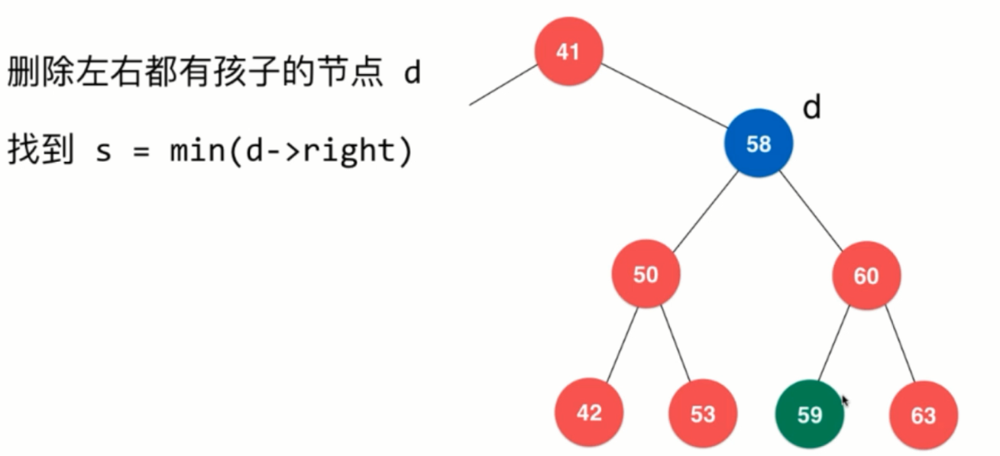
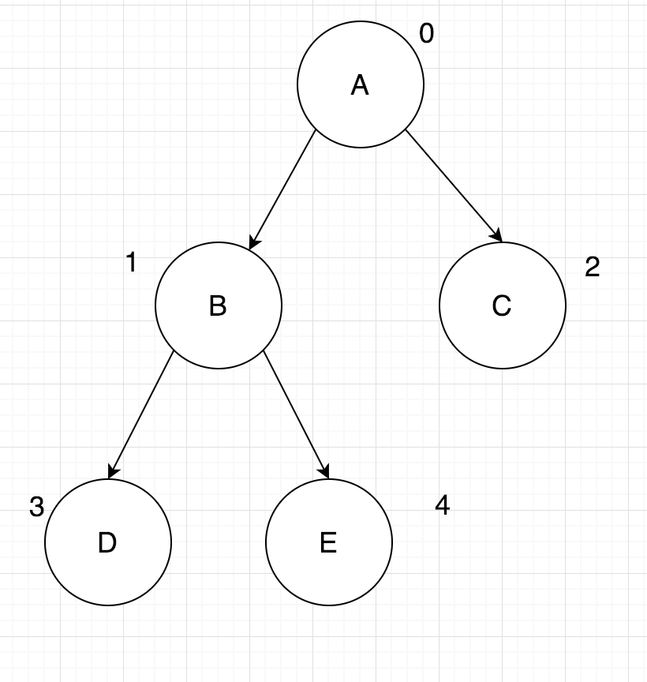
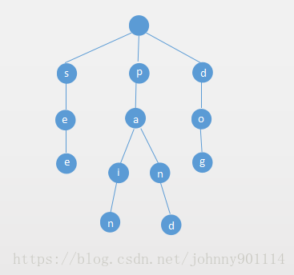
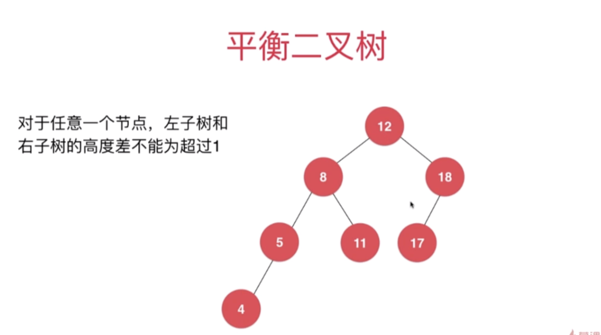
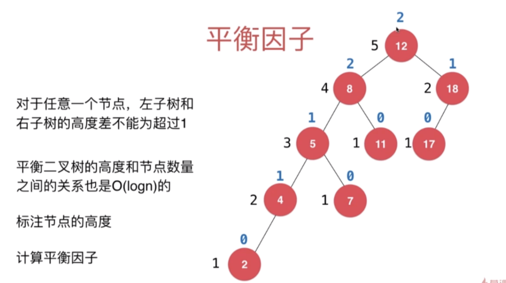

# 算法

标签（空格分隔）： 算法

---

合并两个有序链表
--------

思路,将一个链表的元素逐个插入拷贝到另外一个链表.拷贝单个元素的过程中,需要记录上一次元素插入的pos位置,下一次插入元素从pos+1位置开始往后寻找正确的插入位置.
```java
package com.audi.algorithm;

import java.util.LinkedList;
import java.util.List;

public class MergeTwoList {

    // merge two list, both are sorted, lower to higher
    public static List merge(List<Integer> list1, List<Integer> list2) {
        if (list1 == null && list2 == null) {
            return null;
        }
        if (list1 == null) {
            return list2;
        }
        if (list2 == null) {
            return list1;
        }

        List newList = null;

        // choose the longer list as the destList
        if (list1.size() > list2.size()) {
            newList = list1;

            copy(list2, list1);
        } else {
            newList = list2;

            copy(list1, list2);
        }

        return newList;
    }

    private static void copy(List<Integer> src, List<Integer> dst) {
        int pos = 0;
        int temp = 0;

        for (int i = 0; i < src.size(); i++) {
            temp = src.get(i);
            for (int j = pos; j < dst.size(); j++) {
                // 下面这个if判断主要是为了解决在newList的头部插入元素的问题
                if (pos == 0 && temp < dst.get(0)) {
                    dst.add(0, temp);
                    pos = j + 1;
                    break;
                }

                if (temp >= dst.get(j) && temp < dst.get(j + 1)) {
                    // 稳定排序
                    pos = j + 1;
                    dst.add(pos, temp);
                    break;
                }
            }
        }

    }

    public static void main(String[] args) {
        List<Integer> list1 = new LinkedList<>();
        list1.add(1);
        list1.add(2);
        list1.add(5);
        list1.add(9);

        List<Integer> list2 = new LinkedList<>();
        list2.add(2);
        list2.add(7);
        list2.add(8);
        list2.add(8);
        list2.add(9);
        list2.add(19);

        System.out.println("before merge:");
        System.out.println(list1);
        System.out.println(list2);
        System.out.println();
        List newList = merge(list1, list2);
        System.out.println("after merge:");
        System.out.println(newList);

    }
}
```

代码输出结果:
```java
before merge:
[1, 2, 5, 9]
[2, 7, 8, 8, 9, 19]

after merge:
[1, 2, 2, 5, 7, 8, 8, 9, 9, 19]

Process finished with exit code 0
```

更一般的，考虑leetcode 21 的合并有序链表的题目。可以使用虚拟节点，来辅助实现链表的合并。源码如下：

```java
package com.audi.list;

import java.util.LinkedList;
import java.util.List;

/**
 * https://leetcode.com/problems/merge-two-sorted-lists/
 * <p>
 * 合并有序列表
 *
 * @author WangQuanzhou
 * @date 2020-02-23
 */
public class MergeList<E extends Comparable<E>> {

    public class ListNode {
        int val;
        ListNode next;

        ListNode(int x) {
            val = x;
        }
    }

    /**
     * 合并两个有序列表
     * <p>
     * 通过添加虚拟节点作为辅助
     *
     * @param l1
     * @param l2
     * @return
     */
    public ListNode mergeTwoLists(ListNode l1, ListNode l2) {

        if (null == l1) {
            return l2;
        }
        if (null == l2) {
            return l1;
        }

        ListNode dummyNode = new ListNode(0);
        ListNode cur = dummyNode;

        while (l1 != null && l2 != null) {
            if (l1.val > l2.val) {
                cur.next = l2;
                l2 = l2.next;
            } else {
                cur.next = l1;
                l1 = l1.next;
            }
            cur = cur.next;
        }

        if (l1 == null) {
            cur.next = l2;
        }
        if (l2 == null) {
            cur.next = l1;
        }

        return dummyNode.next;
    }

}
```


0-1背包问题
-------

 
 https://www.cnblogs.com/xym4869/p/8513801.html
 
 参考上面的链接，重点是链接中的几张图，我贴在下面了：
 
 ![此处输入图片的描述][1]
 ![此处输入图片的描述][2]
 ![此处输入图片的描述][3]
 
 上面解释了递推公式的过程，以及原理。尤其注意图中的，当可以把第i个物品放入口袋的时候，那么也就是需要将之前的物品（不一定是之前的i-1个，因为还可能之前的某几个物品需要拿出来）放入容量为j-w(i)的背包中。
 
 此外，还需要注意的一点是：当背包装的物品的价值达到最大时，哪些物品被装入了，这个在上面的图中也有推倒。
 
 0-1背包问题的示例代码：
```java
 public int knapsack(int W, int N, int[] weights, int[] values) {
    int[][] dp = new int[N + 1][W + 1];
    for (int i = 1; i <= N; i++) {
        int w = weights[i - 1], v = values[i - 1];
        for (int j = 1; j <= W; j++) {
            if (j >= w) {
                dp[i][j] = Math.max(dp[i - 1][j], dp[i - 1][j - w] + v);
            } else {
                dp[i][j] = dp[i - 1][j];
            }
        }
    }
    return dp[N][W];
}
```
 
 

 

最长公共子串
------

 
 https://leetcode.com/problems/maximum-length-of-repeated-subarray/
 
 注意它的状态转移公式，且区别于最长公共子序列。
 

移除所有重复节点（递归实现）
--

 - LeetCode203：Remove Linked List Elements

这道题，题意很简单，就是移除队列中**所有**的重复元素。本质上可以使用递归实现。下图是一个递归的解题思路，使用递归时，要有递归的函数**宏观**的语义认识。


解题时，可以将头结点和剩余的其他节点看成两部分，假设剩余节点以及经过removeElements函数移除了重复节点，那么此时只需要考虑头结点释放需要移除即可。

下面是实现及测试代码：
 
```java
package com.audi.c203;

import org.omg.Messaging.SyncScopeHelper;

import java.util.List;
import java.util.Random;

/**
 * Remove Linked List Elements
 *
 * @author: WangQuanzhou
 * @date: 2020/1/11 16:31
 */
class Solution {
    public ListNode removeElements(ListNode head, int val) {
        if (head == null) {
            return null;
        }
        head.next = removeElements(head.next, val);
        return head.val == val ? head.next : head;
    }


    public static void main(String[] args) {
        ListNode head = new ListNode(1);
        ListNode tail = new ListNode(5);
        head.next = tail;
        for (int i = 1; i <= 5; i++) {
            tail.next = new ListNode(new Random().nextInt(10));
            tail = tail.next;
        }


        System.out.println("移除前：");
        tail = head;
        while (tail != null) {
            System.out.println(tail.val);
            tail = tail.next;
        }
        System.out.println();

        System.out.println("移除后：");
        Solution solution = new Solution();
        head = solution.removeElements(head, 5);
        tail = head;
        while (tail != null) {
            System.out.println(tail.val);
            tail = tail.next;
        }
        System.out.println();
    }
}
```

二叉搜索树
-----

实现二叉搜索树的增删改查，首先约定本搜索树不允许重复元素的出现。首先是add方法：
```java
package com.audi.bst;


/**
 * 二分搜索树
 * <p>
 * 存储的元素E由于需要是可比较的，因此需要继承自Comparable接口
 *
 * @author: WangQuanzhou
 * @date: 2020/1/20 8:29
 */
public class BST<E extends Comparable<E>> {
    class Node {
        // 属性定义成public可以直接访问，不需要get方法
        public E e;
        public Node left, right;

        public Node(E e) {
            this.e = e;
            left = null;
            right = null;
        }
    }


    private Node root;

    private Integer size;

    public BST() {
        root = null;
        size = 0;
    }

    /**
     * 添加元素，返回已有元素个数
     *
     * @param e
     * @return
     */
    public Integer add(E e) {

        // 如果根节点为空
        if (null == root) {
            root = new Node(e);
            return size++;
        }

        add(root, e);

        return size;
    }

    /**
     * 二叉树释放为空
     *
     * @return
     */
    public Boolean isEmpty() {
        return size == 0;
    }

    /**
     * 二叉树的大小
     *
     * @return
     */
    public Integer size() {
        return size;
    }

    private void add(Node node, E e) {
        // 不允许添加重复元素
        if (e.equals(node.e)) {
            return;
        }
        // 如果添加位置左右子树为空
        if (e.compareTo(node.e) < 0 && node.left == null) {
            Node left = new Node(e);
            node.left = left;
            size++;
            return;
        }
        if (e.compareTo(node.e) > 0 && node.right == null) {
            Node right = new Node(e);
            node.right = right;
            size++;
            return;
        }


        // 如果添加位置左右子树不为空，递归调用add
        if (e.compareTo(node.e) < 0) {
            add(node.left, e);
        }
        if (e.compareTo(node.e) > 0) {
            add(node.right, e);
        }
    }

}
```

为了验证我们的add操作是正确的，我们实现以下二叉树的递归遍历，打印输出，看看结果是否正确(这里以中序遍历为例进行演示)：
```java
    /**
     * 中序遍历二叉树
     */
    public void inOrder() {
        inOrder(root);
    }

    private void inOrder(Node root) {
        if (null == root) {
            return;
        }
        inOrder(root.left);
        System.out.print(root.e + " ");
        inOrder(root.right);
    }

    public static void main(String[] args) {
        BST<Integer> bst = new BST<>();
        for (int i = 0; i < 8; i++) {
            int temp = new Random().nextInt(100);
            System.out.print(temp + " ");
            bst.add(temp);
        }
        System.out.println();
        bst.inOrder();
    }
```
测试代码输出：
```java
55 12 26 11 97 56 17 43 
11 12 17 26 43 55 56 97 
```
然后是递归前序遍历的代码：
```java
    /**
     * 前序遍历
     */
    public void preOrder() {
        preOrder(root);
    }

    private void preOrder(Node root) {
        if (null == root) {
            return;
        }
        System.out.print(root.e + " ");
        preOrder(root.left);
        preOrder(root.right);
    }

    public static void main(String[] args) {
        BST<Integer> bst = new BST<>();
        for (int i = 0; i < 8; i++) {
            int temp = new Random().nextInt(100);
            System.out.print(temp + " ");
            bst.add(temp);
        }
        System.out.println();
        bst.preOrder();
        System.out.println();
        bst.inOrder();
    }
```

输出结果如下，这里展示了前序遍历和中序遍历结果的对比：
```java
98 65 5 2 72 11 22 90 
98 65 5 2 11 22 72 90 
2 5 11 22 65 72 90 98 
```
类似的，后续遍历代码如下：
```java
    /**
     * 后序遍历
     */
    public void postOrder() {
        postOrder(root);
    }

    private void postOrder(Node root) {
        if (null == root) {
            return;
        }
        postOrder(root.left);
        postOrder(root.right);
        System.out.print(root.e + " ");
    }
```

然后是一个contains查询方法：
```java
    /**
     * 判断某个元素是否在二叉树中
     *
     * @param e
     * @return true-存在  false-不存在
     */
    public Boolean contains(E e) {
        return contains(root, e);
    }

    private Boolean contains(Node root, E e) {
        if (root == null) {
            return Boolean.FALSE;
        }
        if (root.e.compareTo(e) == 0) {
            return Boolean.TRUE;
        }
        return contains(root.left, e) || contains(root.right, e);
    }
```
或者参照下面的写法，充分利用二分搜索树的节点性质，加快查询的速度：
```java
    // 看二分搜索树中是否包含元素e
    public boolean contains(E e){
        return contains(root, e);
    }

    // 看以node为根的二分搜索树中是否包含元素e, 递归算法
    private boolean contains(Node node, E e){

        if(node == null)
            return false;

        if(e.compareTo(node.e) == 0)
            return true;
        else if(e.compareTo(node.e) < 0)
            return contains(node.left, e);
        else // e.compareTo(node.e) > 0
            return contains(node.right, e);
    }
```

有的时候，可能我们在做二叉树的查询的时候，层序遍历二叉树查询效率来的更快，因此下面我们实现二叉树的层序遍历.

二叉树的层序遍历，需要借助额外的数据结构来暂存遍历过程中的二叉树的临时节点，这里我们使用FIFO的队列来保存遍历节点的左右子节点信息，源码如下：
```java
    /**
     * 二叉树的层序遍历，借助FIFO的队列实现
     */
    public void levelOrder() {
        if (root == null) {
            return;
        }
        LinkedList<Node> list = new LinkedList<>();
        list.add(root);
        while (!list.isEmpty()) {
            Node head = list.poll();
            System.out.println(head.e);
            if (head.left != null) {
                list.add(head.left);
            }
            if (head.right != null) {
                list.add(head.right);
            }
        }
    }
```

下面是二叉树的节点删除操作，删除操作，相对复杂一些，因为涉及元素节点的移动。

当待删除节点没有左子树时，直接删除该节点，并使用右子树替换该节点位置。右子树为空时也是一样的情况。

唯一复杂一点的是，当待删除节点的左右子树都不为空时，那么该怎么办？使用Hibbard Deletion理论，使用待删除节点右子树的最小值替换待删除节点，示意图如下：


为了实现删除操作，我们需要实现删除最小节点，查找最小节点，以及真正的删除方法：
```java
    // 寻找二分搜索树的最小元素
    public E minimum(){
        if(size == 0)
            throw new IllegalArgumentException("BST is empty!");

        return minimum(root).e;
    }

    // 返回以node为根的二分搜索树的最小值所在的节点
    private Node minimum(Node node){
        if(node.left == null)
            return node;
        return minimum(node.left);
    }

    // 寻找二分搜索树的最大元素
    public E maximum(){
        if(size == 0)
            throw new IllegalArgumentException("BST is empty");

        return maximum(root).e;
    }

    // 返回以node为根的二分搜索树的最大值所在的节点
    private Node maximum(Node node){
        if(node.right == null)
            return node;

        return maximum(node.right);
    }

    // 从二分搜索树中删除最小值所在节点, 返回最小值
    public E removeMin(){
        E ret = minimum();
        root = removeMin(root);
        return ret;
    }

    // 删除掉以node为根的二分搜索树中的最小节点
    // 返回删除节点后新的二分搜索树的根
    private Node removeMin(Node node){

        if(node.left == null){
            Node rightNode = node.right;
            node.right = null;
            size --;
            return rightNode;
        }

        node.left = removeMin(node.left);
        return node;
    }

    // 从二分搜索树中删除最大值所在节点
    public E removeMax(){
        E ret = maximum();
        root = removeMax(root);
        return ret;
    }

    // 删除掉以node为根的二分搜索树中的最大节点
    // 返回删除节点后新的二分搜索树的根
    private Node removeMax(Node node){

        if(node.right == null){
            Node leftNode = node.left;
            node.left = null;
            size --;
            return leftNode;
        }

        node.right = removeMax(node.right);
        return node;
    }

    // 从二分搜索树中删除元素为e的节点
    public void remove(E e){
        root = remove(root, e);
    }

    // 删除掉以node为根的二分搜索树中值为e的节点, 递归算法
    // 返回删除节点后新的二分搜索树的根
    private Node remove(Node node, E e){

        if( node == null )
            return null;

        if( e.compareTo(node.e) < 0 ){
            node.left = remove(node.left , e);
            return node;
        }
        else if(e.compareTo(node.e) > 0 ){
            node.right = remove(node.right, e);
            return node;
        }
        else{   // e.compareTo(node.e) == 0

            // 待删除节点左子树为空的情况
            if(node.left == null){
                Node rightNode = node.right;
                node.right = null;
                size --;
                return rightNode;
            }

            // 待删除节点右子树为空的情况
            if(node.right == null){
                Node leftNode = node.left;
                node.left = null;
                size --;
                return leftNode;
            }

            // 待删除节点左右子树均不为空的情况

            // 找到比待删除节点大的最小节点, 即待删除节点右子树的最小节点
            // 用这个节点顶替待删除节点的位置
            Node successor = minimum(node.right);
            successor.right = removeMin(node.right);
            successor.left = node.left;

            node.left = node.right = null;

            return successor;
        }
    }
```

需要注意的是，由于删除操作可能会影响root节点（比如删除root节点），所以需要在remove方法返回最新的root节点。


堆
-

堆分为大堆和最小堆，其实他们很类似，只是父节点与子节点的大小关系的比较不一致而已。我们以最大堆为例。

https://www.jianshu.com/p/21bef3fc3030

最大堆有如下一些特性：

 - 它是一颗完全二叉树
 - 父结点的data域值都不小于（大于）其子结点的data域值

什么是完全二叉树？

假设二叉树有h层，那么h-1层及以上都是满二叉树。且第h层（叶子节点）节点均靠左分布。如下图所示：



这里，我们底层使用数组来存储堆中的元素。且由于其是满二叉树，因此其父子节点的index具有如下性质：

假设父节点位置为index，那么左子节点的left_index=index*2+1，右子节点的right_idex=index*2+2。

这里数组我们使用java提供的ArrayList来实现。

首先是建堆的过程，注意我们建堆的逻辑都是将新元素添加到数组的末尾，然后进行上浮（siftUp）操作直至满足最大堆的性质，代码如下：

```java
package com.audi.heap;

import java.util.ArrayList;

/**
 * 最大堆
 *
 * @param <E>
 */
public class MaxHeap<E extends Comparable<E>> {

    private ArrayList<E> data;

    public MaxHeap(int capacity) {
        data = new ArrayList<>(capacity);
    }

    public MaxHeap() {
        data = new ArrayList<>();
    }

    // 返回堆中的元素个数
    public int size() {
        return data.size();
    }

    // 返回一个布尔值, 表示堆中是否为空
    public boolean isEmpty() {
        return data.isEmpty();
    }

    // 返回完全二叉树的数组表示中，一个索引所表示的元素的父亲节点的索引
    private int parent(int index) {
        if (index == 0)
            throw new IllegalArgumentException("index-0 doesn't have parent.");
        return (index - 1) / 2;
    }

    // 返回完全二叉树的数组表示中，一个索引所表示的元素的左孩子节点的索引
    private int leftChild(int index) {
        return index * 2 + 1;
    }

    // 返回完全二叉树的数组表示中，一个索引所表示的元素的右孩子节点的索引
    private int rightChild(int index) {
        return index * 2 + 2;
    }

    // 向堆中添加元素
    public void add(E e) {
        data.add(e);
        siftUp(data.size() - 1);
    }

    private void siftUp(int k) {

        while (k > 0 && data.get(parent(k)).compareTo(data.get(k)) < 0) {
            swap(data, k, parent(k));
            k = parent(k);
        }
    }

    /**
     * 交换data数组的i j位置的元素
     *
     * @param data
     * @param i
     * @param j
     */
    private void swap(ArrayList<E> data, int i, int j) {
        if (i > data.size() - 1 || j > data.size() - 1) {
            return;
        }
        E temp = data.get(i);
        data.set(i, data.get(j));
        data.set(j, temp);
    }
}
```

然后实现寻找堆中最大元素，以及取出堆中最大元素的过程。

最大元素，根据最大堆的性质其实就是取堆顶的元素，也就是数组的首个元素。

取出该最大元素稍微有点麻烦，因为涉及到元素的调整。这里采取的措施是，删除数组头元素，将数组最后一个元素放到数组头部，然后进行siftDown操作，直至满足最大堆的性质。

```java
    // 看堆中的最大元素
    public E findMax() {
        if (data.size() == 0)
            throw new IllegalArgumentException("Can not findMax when heap is empty.");
        return data.get(0);
    }

    // 取出堆中最大元素
    public E extractMax() {

        E ret = findMax();

        swap(data, 0, data.size() - 1);
        data.remove(data.size() - 1);
        siftDown(0);

        return ret;
    }

    private void siftDown(int k) {

        while (leftChild(k) < data.size()) {
            int j = leftChild(k); // 在此轮循环中,data[k]和data[j]交换位置
            // 选出左右子树种中较大的元素
            if (j + 1 < data.size() &&
                    data.get(j + 1).compareTo(data.get(j)) > 0)
                j++;

            // data[j] 是 leftChild 和 rightChild 中的最大值
            if (data.get(k).compareTo(data.get(j)) >= 0)
                break;

            swap(data, k, j);
            k = j;
        }
    }
```

然后是一个replace函数：
```java
    // 取出堆中的最大元素，并且替换成元素e
    public E replace(E e){

        E ret = findMax();
        data.set(0, e);
        siftDown(0);
        return ret;
    }
```

堆一般适合于求解最大K个元素：

347. Top K Frequent Elements

该题首先使用map统计各个元素出现的次数，然后使用size为k的最大堆将map的元素入堆，最后将堆中元素全部取出，即是top k的元素。
```java
    private class Freq implements Comparable<Freq> {

        public int e, freq;

        public Freq(int e, int freq) {
            this.e = e;
            this.freq = freq;
        }

        @Override
        public int compareTo(Freq another) {
            if (this.freq < another.freq)
                return 1;
            else if (this.freq > another.freq)
                return -1;
            else
                return 0;
        }
    }

    public List<Integer> topKFrequent(int[] nums, int k) {

        TreeMap<Integer, Integer> map = new TreeMap<>();
        for (int num : nums) {
            if (map.containsKey(num))
                map.put(num, map.get(num) + 1);
            else
                map.put(num, 1);
        }

        MaxHeap<Freq> maxHeap = new MaxHeap<>();
        for (int key : map.keySet()) {
            if (maxHeap.size() < k)
                maxHeap.add(new Freq(key, map.get(key)));
            else if (map.get(key) > maxHeap.findMax().freq) {
                maxHeap.extractMax();
                maxHeap.add(new Freq(key, map.get(key)));
            }
        }

        List<Integer> res = new LinkedList<>();
        while (!maxHeap.isEmpty())
            res.add(maxHeap.extractMax().e);
        return res;
    }
```

如果将上面的TreeMap换成HashMap，那么将大大加快算法的速度，约比上面的代码提升3-4倍的速度。
```java
    private class Freq implements Comparable<Freq> {

        public int e, freq;

        public Freq(int e, int freq) {
            this.e = e;
            this.freq = freq;
        }

        @Override
        public int compareTo(Freq another) {
            if (this.freq < another.freq)
                return 1;
            else if (this.freq > another.freq)
                return -1;
            else
                return 0;
        }
    }

    public List<Integer> topKFrequent(int[] nums, int k) {

        Map<Integer, Integer> map = new HashMap<>(nums.length);
        for (int num : nums) {
            if (map.containsKey(num))
                map.put(num, map.get(num) + 1);
            else
                map.put(num, 1);
        }

        MaxHeap<Freq> maxHeap = new MaxHeap<>();
        for (int key : map.keySet()) {
            if (maxHeap.size() < k)
                maxHeap.add(new Freq(key, map.get(key)));
            else if (map.get(key) > maxHeap.findMax().freq) {
                maxHeap.extractMax();
                maxHeap.add(new Freq(key, map.get(key)));
            }
        }

        List<Integer> res = new LinkedList<>();
        while (!maxHeap.isEmpty())
            res.add(maxHeap.extractMax().e);
        return res;
    }
```

当然对于这种top k的问题也可以使用大小为k数组实现。思路大致是，创建一个数组，当数组大小小于k的时候往内部添加元素，并进行排序。当数组大小达到k的时候，后续元素是否放入数组需要将该元素的频次与数组最小频次比较，大于的话，就替换数组首元素。

但是这种方式并不比上面的最大堆的算法快，原因在于太多次的排序过程。

```java
package com.audi.heap;

import java.util.*;
import java.util.stream.Collectors;

//347. Top K Frequent Elements
public class Solution {

    private class Freq implements Comparable<Freq> {

        public int e, freq;

        public Freq(int e, int freq) {
            this.e = e;
            this.freq = freq;
        }

        @Override
        public int compareTo(Freq another) {
            if (this.freq < another.freq)
                return 1;
            else if (this.freq > another.freq)
                return -1;
            else
                return 0;
        }
    }

    public List<Integer> topKFrequent(int[] nums, int k) {

        Map<Integer, Integer> map = new HashMap<>(nums.length);
        for (int num : nums) {
            if (map.containsKey(num))
                map.put(num, map.get(num) + 1);
            else
                map.put(num, 1);
        }

        List<Freq> list = new LinkedList<>();
        for (int key : map.keySet()) {
            if (list.size() < k) {
                list.add(new Freq(key, map.get(key)));
                list = list.stream().sorted(Comparator.comparing(item -> item.freq)).collect(Collectors.toList());
            } else {
                if (map.get(key) <= list.get(0).freq) {
                    continue;
                }
                list.set(0, new Freq(key, map.get(key)));
                list = list.stream().sorted(Comparator.comparing(item -> item.freq)).collect(Collectors.toList());
            }
        }
        return list.stream().map(freq -> freq.e).collect(Collectors.toList());
    }

    public static void main(String[] args) {
        Solution solution = new Solution();
        int[] nums = {5, 2, 5, 3, 5, 3, 1, 1, 3};
        System.out.println(solution.topKFrequent(nums, 2));
    }
}
```

Trie
----
https://blog.csdn.net/johnny901114/article/details/80711441

Trie，字典树，结构如下图所示，当然节点可以存储任意字符，不一定是字母。注意，Trie的根节点其实是空的，没有存储实质的数据。



下面是往trie添加元素的过程。
```java
package com.audi.trie;

import java.util.TreeMap;

public class Trie {

    private class Node{

        /**
         * 当前节点是否是完整的单词
         */
        public boolean isWord;

        /**
         * 当前节点的后继节点，因为不确定后继节点个数，这里使用map存储
         */
        public TreeMap<Character, Node> next;

        public Node(boolean isWord){
            this.isWord = isWord;
            next = new TreeMap<>();
        }

        public Node(){
            this(false);
        }
    }

    private Node root;
    private int size;

    public Trie(){
        root = new Node();
        size = 0;
    }

    // 获得Trie中存储的单词数量
    public int getSize(){
        return size;
    }

    // 向Trie中添加一个新的单词word
    public void add(String word){

        Node cur = root;
        for(int i = 0 ; i < word.length() ; i ++){
            char c = word.charAt(i);
            if(cur.next.get(c) == null)
                cur.next.put(c, new Node());
            cur = cur.next.get(c);
        }

        // 避免重复标记单词，首先判断一下当前位置是否已是一个完整的单词
        if(!cur.isWord){
            cur.isWord = true;
            size ++;
        }
    }
}
```

trie的搜索，实就是查询某个字符串是否在trie中存在。查询思路是：不断遍历字符串的每个字符，如果便利到了字符串的末尾，再判断当前位置是否是字符串（isWord=true）。源码如下：
```java
    // 查询单词word是否在Trie中
    public boolean contains(String word){

        Node cur = root;
        for(int i = 0 ; i < word.length() ; i ++){
            char c = word.charAt(i);
            if(cur.next.get(c) == null)
                return false;
            cur = cur.next.get(c);
        }
        return cur.isWord;
    }
```

上面是查询完整的字符串，还有一种就是查询前缀字符串。即，只要包含前缀字符串就行，不要求是个完整的字符串。其实这个查找过程和上面很类似，源码如下：
```java
    // 查询是否在Trie中有单词以prefix为前缀
    public boolean isPrefix(String prefix){

        Node cur = root;
        for(int i = 0 ; i < prefix.length() ; i ++){
            char c = prefix.charAt(i);
            if(cur.next.get(c) == null)
                return false;
            cur = cur.next.get(c);
        }

        return true;
    }
```

前缀搜索，可以应用于leetcode208。其实和上面的trie很相似，只是方法的名称变了一下。源码如下：

```java
package com.audi.trie;

import java.util.TreeMap;

/**
 * Trie
 * <p>
 * https://leetcode.com/problems/implement-trie-prefix-tree/
 *
 * @author WangQuanzhou
 * @date 2020-02-15
 */
public class Trie208 {

    private class Node {

        /**
         * 当前节点是否是完整的单词
         */
        public boolean isWord;

        /**
         * 当前节点的后继节点，因为不确定后继节点个数，这里使用map存储
         */
        public TreeMap<Character, Node> next;

        public Node(boolean isWord) {
            this.isWord = isWord;
            next = new TreeMap<>();
        }

        public Node() {
            this(false);
        }
    }

    private Node root;
    private int size;

    public Trie208() {
        root = new Node();
        size = 0;
    }

    // 获得Trie中存储的单词数量
    public int getSize() {
        return size;
    }

    // 向Trie中添加一个新的单词word
    public void insert(String word) {

        Node cur = root;
        for (int i = 0; i < word.length(); i++) {
            char c = word.charAt(i);
            if (cur.next.get(c) == null)
                cur.next.put(c, new Node());
            cur = cur.next.get(c);
        }

        // 避免重复标记单词，首先判断一下当前位置是否已是一个完整的单词
        if (!cur.isWord) {
            cur.isWord = true;
            size++;
        }
    }

    // 查询单词word是否在Trie中
    public boolean search(String word) {

        Trie208.Node cur = root;
        for (int i = 0; i < word.length(); i++) {
            char c = word.charAt(i);
            if (cur.next.get(c) == null)
                return false;
            cur = cur.next.get(c);
        }
        return cur.isWord;
    }

    // 查询是否在Trie中有单词以prefix为前缀
    public boolean startsWith(String prefix) {

        Trie208.Node cur = root;
        for (int i = 0; i < prefix.length(); i++) {
            char c = prefix.charAt(i);
            if (cur.next.get(c) == null)
                return false;
            cur = cur.next.get(c);
        }

        return true;
    }
}
```


此外leetCode211号问题，也可以使用Trie解决，不过有点区别的是查询过程，211号问题是支持正则匹配的。

```java
package com.audi.trie;/// Leetcode 211. Add and Search Word - Data structure design
/// https://leetcode.com/problems/add-and-search-word-data-structure-design/description/

import java.util.TreeMap;

public class WordDictionary {

    private class Node {

        public boolean isWord;
        public TreeMap<Character, Node> next;

        public Node(boolean isWord) {
            this.isWord = isWord;
            next = new TreeMap<>();
        }

        public Node() {
            this(false);
        }
    }

    private Node root;

    /**
     * Initialize your data structure here.
     */
    public WordDictionary() {
        root = new Node();
    }

    /**
     * Adds a word into the data structure.
     */
    public void addWord(String word) {

        Node cur = root;
        for (int i = 0; i < word.length(); i++) {
            char c = word.charAt(i);
            if (cur.next.get(c) == null)
                cur.next.put(c, new Node());
            cur = cur.next.get(c);
        }
        cur.isWord = true;
    }

    /**
     * Returns if the word is in the data structure. A word could contain the dot character '.' to represent any one letter.
     */
    public boolean search(String word) {
        return match(root, word, 0);
    }

    /**
     * 地柜调用match
     *
     * @param node
     * @param word
     * @param index
     * @return
     */
    private boolean match(Node node, String word, int index) {

        if (index == word.length())
            return node.isWord;

        char c = word.charAt(index);

        if (c != '.') {
            if (node.next.get(c) == null)
                return false;
            return match(node.next.get(c), word, index + 1);
        } else {
            for (char nextChar : node.next.keySet())
                if (match(node.next.get(nextChar), word, index + 1))
                    return true;
            return false;
        }
    }
}
```

AVL-Tree
---

https://blog.csdn.net/qq_25343557/article/details/89110319

AVL（G. M. Adelson-Velsky和E. M. Landis名字的缩写）树主要是为了解决二分搜索树（BST）的不平衡性带来的弊端，提高树结构的遍历查询效率。

AVL提高效率的关键就是在添加元素的过程中，通过不断“旋转”树的左右分支，从而保证树结构始终是平衡二叉树。

平衡二叉树：对于树的任意节点，其左右子树的高度差不能超过1.下图展示的就是一颗平衡二叉树。



为了维护二叉树的平衡性，我们需要借助平衡因子的概念。所谓平衡因子，其实就是左右节点的高度值之差。对于一颗平衡二叉树，任意节点的平衡因子都是-1，0，1中的一个，否则就不是平衡二叉树。平衡因子的简要计算如下图中蓝色数字所示：



借助之前BST的实现，我们稍加修改即可变成AVL树。首先我们需要实现平衡因子的维护，当AVL树添加元素以后，有可能会影响树的平衡性，因此我们需要在add函数内部维护节点高度及平衡因子：
```java
import java.util.ArrayList;

public class AVLTree<K extends Comparable<K>, V> {

    private class Node {
        public K key;
        public V value;
        public Node left, right;
        // 增加height记录高度
        public int height;

        public Node(K key, V value) {
            this.key = key;
            this.value = value;
            left = null;
            right = null;
            // 对于所有的新节点默认高度都是1
            height = 1;
        }
    }

    private Node root;
    private int size;

    public AVLTree() {
        root = null;
        size = 0;
    }

    public int getSize() {
        return size;
    }

    public boolean isEmpty() {
        return size == 0;
    }

    // 获得节点node的高度
    private int getHeight(Node node) {
        if (node == null)
            return 0;
        return node.height;
    }

    // 获得节点node的平衡因子   节点的左右高度值之差
    private int getBalanceFactor(Node node) {
        if (node == null)
            return 0;
        return getHeight(node.left) - getHeight(node.right);
    }

    // 向二分搜索树中添加新的元素(key, value)
    public void add(K key, V value) {
        root = add(root, key, value);
    }

    // 向以node为根的二分搜索树中插入元素(key, value)，递归算法
    // 返回插入新节点后二分搜索树的根
    private Node add(Node node, K key, V value) {

        if (node == null) {
            size++;
            return new Node(key, value);
        }

        if (key.compareTo(node.key) < 0)
            node.left = add(node.left, key, value);
        else if (key.compareTo(node.key) > 0)
            node.right = add(node.right, key, value);
        else // key.compareTo(node.key) == 0
            node.value = value;

        // 更新height  左右子树的最大高度值
        node.height = 1 + Math.max(getHeight(node.left), getHeight(node.right));

        // 计算平衡因子   若不平衡，进行打印输出
        int balanceFactor = getBalanceFactor(node);
        if (Math.abs(balanceFactor) > 1)
            System.out.println("unbalanced : " + balanceFactor);

        return node;
    }

    // 返回以node为根节点的二分搜索树中，key所在的节点
    private Node getNode(Node node, K key) {

        if (node == null)
            return null;

        if (key.equals(node.key))
            return node;
        else if (key.compareTo(node.key) < 0)
            return getNode(node.left, key);
        else // if(key.compareTo(node.key) > 0)
            return getNode(node.right, key);
    }

    public boolean contains(K key) {
        return getNode(root, key) != null;
    }

    public V get(K key) {

        Node node = getNode(root, key);
        return node == null ? null : node.value;
    }

    public void set(K key, V newValue) {
        Node node = getNode(root, key);
        if (node == null)
            throw new IllegalArgumentException(key + " doesn't exist!");

        node.value = newValue;
    }

    // 返回以node为根的二分搜索树的最小值所在的节点
    private Node minimum(Node node) {
        if (node.left == null)
            return node;
        return minimum(node.left);
    }

    // 删除掉以node为根的二分搜索树中的最小节点
    // 返回删除节点后新的二分搜索树的根
    private Node removeMin(Node node) {

        if (node.left == null) {
            Node rightNode = node.right;
            node.right = null;
            size--;
            return rightNode;
        }

        node.left = removeMin(node.left);
        return node;
    }

    // 从二分搜索树中删除键为key的节点
    public V remove(K key) {

        Node node = getNode(root, key);
        if (node != null) {
            root = remove(root, key);
            return node.value;
        }
        return null;
    }

    private Node remove(Node node, K key) {

        if (node == null)
            return null;

        if (key.compareTo(node.key) < 0) {
            node.left = remove(node.left, key);
            return node;
        } else if (key.compareTo(node.key) > 0) {
            node.right = remove(node.right, key);
            return node;
        } else {   // key.compareTo(node.key) == 0

            // 待删除节点左子树为空的情况
            if (node.left == null) {
                Node rightNode = node.right;
                node.right = null;
                size--;
                return rightNode;
            }

            // 待删除节点右子树为空的情况
            if (node.right == null) {
                Node leftNode = node.left;
                node.left = null;
                size--;
                return leftNode;
            }

            // 待删除节点左右子树均不为空的情况

            // 找到比待删除节点大的最小节点, 即待删除节点右子树的最小节点
            // 用这个节点顶替待删除节点的位置
            Node successor = minimum(node.right);
            successor.right = removeMin(node.right);
            successor.left = node.left;

            node.left = node.right = null;

            return successor;
        }
    }
}
```
为了校验我们后续实现的树是否是二分搜索树或者平衡二叉树，我们编写如下的辅助函数进行判断：

判断是否是二分搜索树：
```java
    // 判断该二叉树是否是一棵二分搜索树
    public boolean isBST2() {
        return isBST2(root);
    }

    private boolean isBST2(Node node) {
        if (node == null) {
            return true;
        }
        if (node.left.key.compareTo(node.key) > 0
                || node.left.key.compareTo(node.right.key) > 0
                || node.key.compareTo(node.right.key) > 0) {
            return false;
        }
        return isBST2(node.left) && isBST2(node.right);

    }
```

判断是否是平衡二叉树：


DAG 路径
------

https://www.cnblogs.com/Evsward/p/dag.html


 
  [1]: https://github.com/Audi-A7/learn/blob/master/image/interview/0-1%EF%BC%880%EF%BC%89.jpg?raw=true
  [2]: https://github.com/Audi-A7/learn/blob/master/image/interview/0-1%EF%BC%881%EF%BC%89.jpg?raw=true
  [3]: https://github.com/Audi-A7/learn/blob/master/image/interview/0-1%EF%BC%882%EF%BC%89.jpg?raw=true